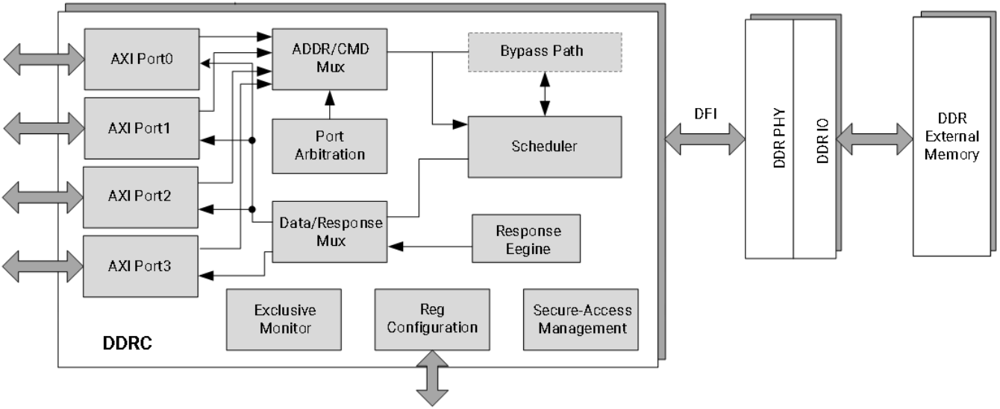
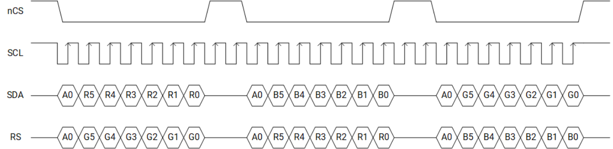
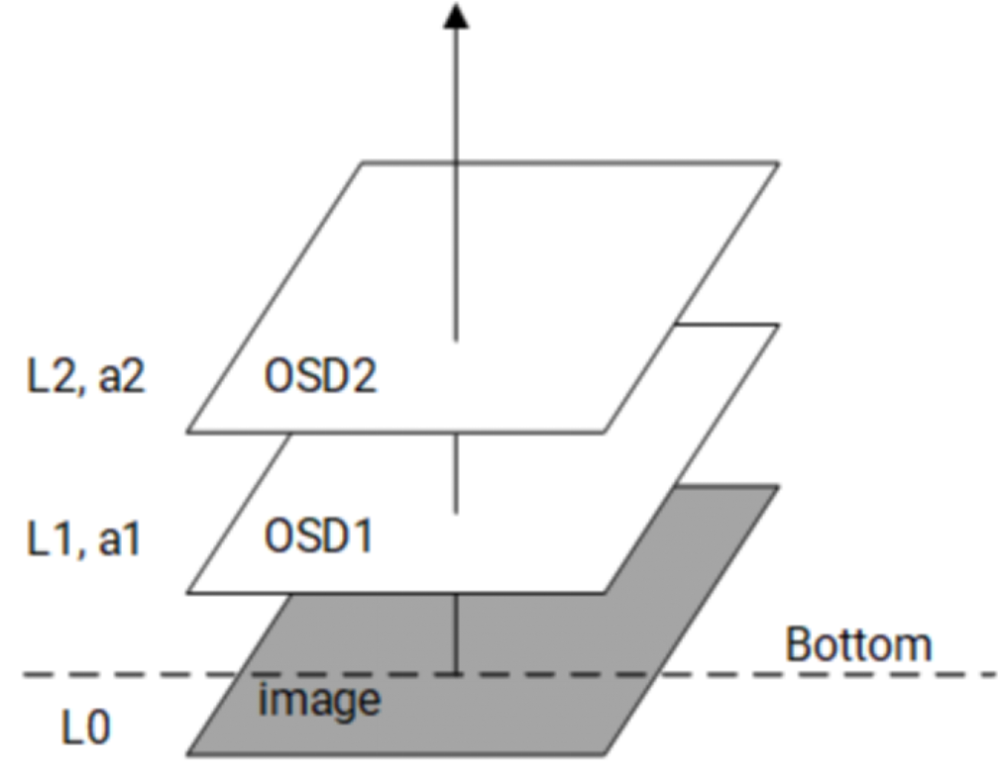
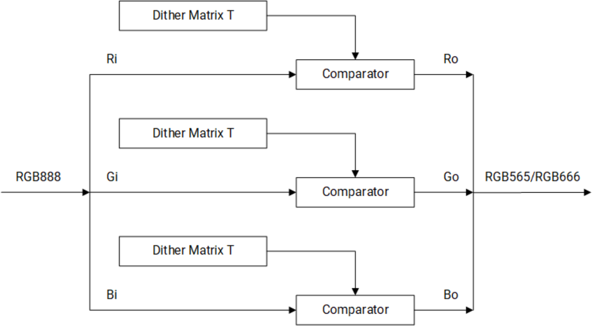
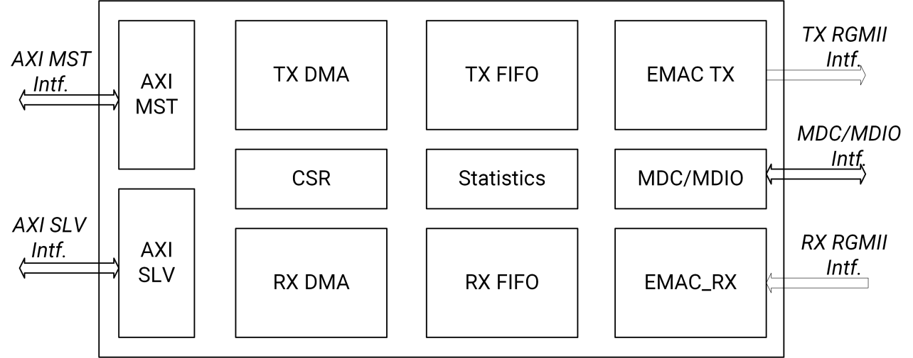
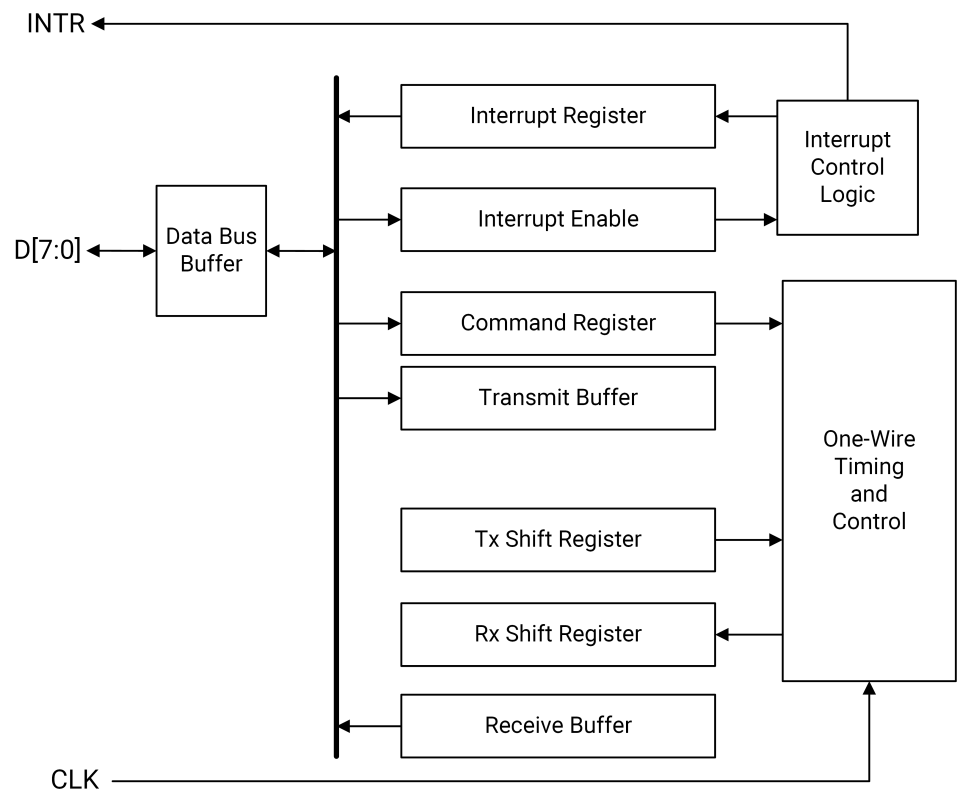
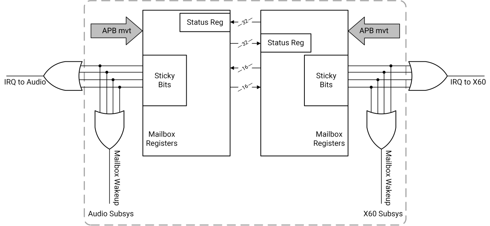
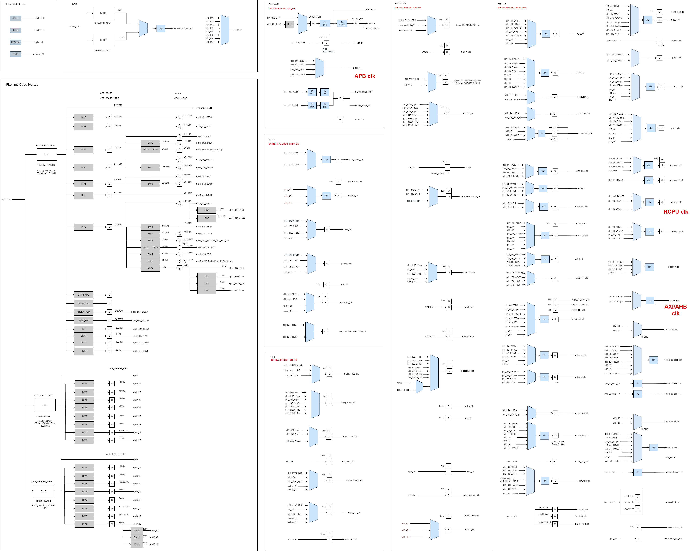

# 2. Specifications

```
Last Version: 2025/xx/xx
```

## 2.1 CPU Subsystem

### 2.1.1 Features

---

- Availability of two asymmetric CPU clusters, where

  - Cluster 0 includes Quad RISC-V SpacemiT® X60™ cores with 2.0 TOPS AI-Power extension
  - Cluster 1 includes Quad RISC-V SpacemiT® X60™ cores without AI capability
- High-performance: low-power SpacemiT® X60™ CPU core adheres to RISC-V 64GCVB architecture and RVA22 standard
- Support for a processor core local interrupt controller (CLINT) and a platform level interrupt controller (PLIC)
- Compliance with RISC-V debug V0.13.2 standard
- Capture of a snapshot of critical CPU information upon watchdog reset to aid debugging
- Power islands and two-level power strategies design for each CPU core and clusters in order to achieve ultra-low power consumption

### **2.1.2 SpacemiT® X60™ RISC-V Core**

---

#### 2.1.2.1 Introduction

---

X60™ is an innovative high-efficiency processor core with SpacemiT® Daoyi™ AI innovation deployment that adheres to RISC-V 64GCVB and RVA22 standards.

In order to meet the current and future computational demand, X60™ incorporates numerous DSA technologies and micro-architecture optimizations, and provides robust computing power for AI applications, machine learning, SLAM, etc.

#### 2.1.2.2 Features

---

- Compliance with RISC-V 64GCVB and RVA22 standards
- Each core has 32KB L1-I cache and 32KB L1-D cache
- Each cluster contains 512KB L2 cache
- Cluster 0 integrates 512KB TCM (Tight-Coupled Memory) for AI extension
- L1 cache supports MESI consistency protocol, instead L2 cache supports MOESI consistency protocol
- Vector extension: RVV1.0 with VLEN 256/128-bit and x2 execution width
- AI customized instructions explored and implemented in Cluster 0
- Support for CLINT and PLIC with a total of 256 interrupts
- Support for RISC-V performance PMU
- Support for SV39 virtual memory
- Support for 32 PMP entries adhering to RISC-V security framework
- Support for RISC-V debug framework
- Support for the following extensions:

  - RV64I
  - M
  - A
  - F
  - D
  - C
  - V
  - Sscofpmf
  - Sstc
  - Svinval
  - Svnapot
  - Svpbmt
  - Zicbom
  - Zicbop
  - Zicboz
  - Zicntr
  - Zicond
  - Zicsr
  - Zifencei
  - Zihintpause
  - Zihpm
  - Zfh
  - Zfhmin
  - Zkt
  - Zba
  - Zbb
  - Zbc
  - Zbs
  - Zbkc
  - Zvfh
  - Zvfhmin
  - Zvkt
- Support for the following AI customized instructions:

  - Category "<u>Integer dot-product matrix multiply-accumulate (int8 type)</u>", including
    - smt.vmadot
    - smt.vmadotu
    - smt.vmadotsu
    - smt.vmadotus
  - Category "<u>Integer sliding-window dot-product matrix multiply-accumulate (int8 type)</u>", including
    - smt.vmadot1
    - smt.vmadot1u
    - smt.vmadot1su
    - smt.vmadot1us
    - smt.vmadot2
    - smt.vmadot2u
    - smt.vmadot2su
    - smt.vmadot2us
    - smt.vmadot3
    - smt.vmadot3u
    - smt.vmadot3su
    - smt.vmadot3us

  **Note.** For details on all these AI-customized instructions, please refer to [https://github.com/spacemit-com/riscv-ime-extension-spec](https://github.com/spacemit-com/riscv-ime-extension-spec)

#### 2.1.2.3 Block Diagram

---

The micro-architecture of X60™ is depicted below.


### **2.1.3 Interrupt**** Controller**

---

#### 2.1.3.1 Introduction

---

K1 contains

- One Processor Core Local Interrupt Controller (CLINT)
- One Platform Level Interrupt Controller (PLIC)

to manage interrupts for two processor clusters.

The exception handling, which includes exceptions and external interrupts, is an important function of the processor. When specific events occur, the processor redirects to handle them. Such events can include hardware faults, instruction execution errors, user program service requests, and more.

CLINT is a memory address mapped module for handling software interrupts and timer interrupts.

Instead, PLIC samples external interrupt sources, then prioritizes and distributes them accordingly. In the PLIC model, both the machine mode and supervisor mode of each core are valid interrupt targets. PLIC supports up to 256 external interrupt sources. Each interrupt supports both level and edge formats.

### **2.1.4 Debug ****&**** Trace**

---

#### 2.1.4.1 Introduction

---

The debugging interface serves as the channel for software to interact with the processor. Through this interface, users can access CPU registers and memory contents, as well as other on-chip device information. Additionally, tasks such as downloading programs can be performed via the debugging interface.

#### 2.1.4.2 Block Diagram

---

The micro-architecture of the debugging interface is depicted below.


As can be seen, the debugging system consists of

- A debugging software
- A debugging agent service
- A debugger
- A debugging interface

These components are interconnected as follows:

- The debugging software communicates with the debugging agent service over a network
- The debugging agent service connects to the debugger via USB
- The debugger interacts with the CPU through the JTAG interface

The JTAG memory access method could be either _progbuf_ or _sysbus_ mode, where

- The _progbuf_ mode is a standard JTAG method that accesses memory through the CPU
- The _sysbus_ mode bypasses the CPU to access on-chip resources via the System Bus Access (SBA) port

## **2.2 Memory ****&**** Storage        **

### **2.2.1 On-Chip Memory        **

---

#### 2.2.1.1 Introduction

---

K1 includes the following on-chip memory:

- 128KB boot-ROM
- 256KB SRAM shared between Main CPU and RCPU

### **2.2.2 DDR**

---

#### **2.2.2.1 Introduction**

---

The DDR controller features a cutting-edge design that optimizes DRAM access by rearranging requests into an efficient order, rather than processing them in their original sequence. It uses re-ordering buffers (ROBs) to reorganize accesses to the SRAM device for improving performance, while maintaining the original transaction order for requests with the same ID on the AXI interface.

Additionally, the DDR controller includes a unified write pool to temporarily store write transactions. Such write pool minimizes write latency and reduces the performance penalty due to switching between read and write operation at the DRAM interface. With a built-in heuristic write buffer control and user-programmable write buffer control, the DDR controller dynamically balances read and write operation performance in real-time.

The DDR controller is also designed to support AMBA AXI4 bus protocols. It is fully scalable and supports up to 4 AXI ports.

#### **2.2.2.2 ****Features**

---

- Priority-based arbitration with a starvation prevention scheme
- Merge of write operations to the same address by using a write buffer to reduce DDR write operation traffic
- Direct forward of read operations of the write buffer to the ROB without accessing DDR
- Two levels dynamic scheduling with bandwidth guarantee
- Support of power-saving features, including active/pre-charge power-off and self-refresh, with control options available automatically (via idle timer), manually (through registers) or externally (via dedicated ports)
- Support for dynamic frequency change
- Support for JEDEC compliant LPDDR3 and LPDDR4 devices
- Support for DRAM size from 64MB to 16GB
- One DRAM channel with a x32 DDR PHY, programmable by software to support x32, x16 or x8 data width
- Support for x16, x32 DRAM devices (1 DQS per 8 DQ)
- Support for up to 2 Chip Select (CS) or Rank per channel
- Support for up to 8 banks per CS for LPDDRx
- Each CS can be mapped to a different starting address
- Each CS can be programmed for 8MB to 16GB
- DRAM banks can be kept open after access (no auto-pre-charge)
- Support for burst length of 8 and 16 for the applicable DDR type
- Programmable address order
- Flexible bank placement between CS and data width
- Implementation of memory controller performance counters
- Global monitors for RISC-V exclusive load/store access
- Secure access management for DDR transactions
- Frequency change register update: implementation of a register table for hardware-triggered sequence update after frequency changes

#### 2.2.2.3 Block Diagram

---

The architecture of the DDR controller interface is depicted below.



### **2.2.3 Q****uad-****SPI**

---

#### 2.2.3.1 Introduction

---

Quad-SPI acts as an interface to external serial flash devices with up to four bidirectional data lines.

#### 2.2.3.2 Features

---

- Flexible sequence engine to support various flash vendor devices
- Single, dual and quad mode operation
- DMA supports reading RX buffer data via AMBA AHB bus (64-bit width interface) or IP register space (32-bit access), and filling TX buffer via IP register space (32-bit access)
- Configurable DMA inner loop size
- Fifteen interrupt conditions
- Memory-mapped read access for connected flash devices
- Programmable sequence engine for future command/protocol changes, and able to support all existing vendor commands and operations
- Support for all types of addressing
- Support for standard SPI, Fast, Dual, Dual I/O, Quad, Quad I/O mode
- Operation up to 104MHz clock frequency

### **2.2.4 eMMC Interface**

---

#### 2.2.4.1 Introduction

---

The eMMC interface is a hardware block that acts as a host of the eMMC bus to transfer data between eMMC card and the internal bus master.

#### 2.2.4.2 Features

---

- Compliance with the 8 bits eMMC 5.1 protocol specification
- Use of the same SD-HCI register set for eMMC transfers, with additional vendor-specific registers
- Support for 1-bit/8-bit MMC and CE-ATA cards
- Support for the following data transfer types defined in the SD-HCI specification:

  - PIO
  - SDMA
  - ADMA
  - ADMA2
- Support for the SPI mode for eMMC card
- Support for the following speed modes defined in eMMC 5.1:

  - Legacy (up to 26MB/s, 1.8V signal)
  - High-speed SDR (up to 52MB/s, 1.8V signal)
  - High-speed DDR (up to 52MB/s, 1.8V signal)
  - HS200 (up to 200MB/s, 1.8V signal)
  - HS400 (up to 400MB/s, 1.8V signal)
- Hardware generation/checking of CRC for all command and data transactions on the card bus
- 1024-byte FIFO (2 x 512-byte data blocks) for data transmission and reception

### **2.2.5 SD/MMC Interface**

---

#### 2.2.5.1 Introduction

---

The SD/MMC interface is a hardware block that acts as a host of the SD/MMC bus to transfer data between SD/MMC card and the internal bus master.

#### 2.2.5.2 Features

---

- Compliance with the 4-bit SD 3.0 UHS-I protocol specification
- Adoption of the SD-HCI register set with additional vendor-specific registers
- Support for 1-bit/4-bit SD memory
- Support for the following data transfer types defined in the SD-HCI specification:

  - PIO
  - SDMA
  - ADMA
  - ADMA2
- Support for the following speed modes defined in the SD 3.0 specification:

  - Default Speed (up to 12.5MB/s, 3.3V signal)
  - High Speed (up to 25MB/s, 3.3V signal)
  - SDR12 (up to 25 MHz, 1.8V signal)
  - SDR25 (up to 50 MHz, 1.8V signal)
  - SDR50 (up to 100 MHz, 1.8V signal)
  - SDR104 (up to 208 MHz, 1.8V signal)
  - DDR50 (up to 50 MHz, 1.8V signal)
- Hardware generation/checking of CRC for all command and data transactions on the card bus
- Support for the read-wait control feature for SD/MMC cards
- Support for the suspend-resume feature for SD/MMC cards
- SD/MMC card insertion/removal detection feature via GPIO
- 1024 Bytes FIFO (2 x 512 Bytes data block) for data transmission and reception

## **2.3 Image Subsystem        **

### **2.3.1 MIPI Camera IN Interface**

---

#### 2.3.1.1 Introduction

---

The MIPI Camera IN interface features two MIPI-CSI2 v1.1 controllers both equipped with 4 lanes each of which supports a maximum transfer rate of 1.5Gbps.

#### 2.3.1.2 Features

---

- Support for the following modes to allocate lanes to sensors:

  - 4-Lane + 4-Lane mode (double sensor)
  - 4-Lane + 2-Lane mode (double sensor)
  - 4-Lane + 2-Lane + 2-Lane mode (triple sensor)

  > **Note. **In "4-Lane + 2-Lane + 2-Lane mode (triple sensor)", only 2 Bayer RAW and 1 YUV input format are supported.
  >
- Support for the following input formats:

  - Legacy YUV420 8-bit
  - YUV420 8-bit
  - RAW8
  - RAW10
  - RAW12
  - RAW14
  - Embedded data type
- Support for the following types of data interleaving:

  - Data type interleaving
  - Virtual channel interleaving

### **2.3.2 ISP**

---

#### 2.3.2.1 Introduction

---

K1 includes a high-performance Image Signal Processor (ISP) which supports simultaneous processing of up to two raw video streams, with a total processing capacity of 21M@30fps.

#### 2.3.2.2 Features

---

- Support for both video and picture mode
- Processing of RAW sensor data and output of YUV data to DRAM
- Hardware JPEG encoder/decoder (support for up to 23M)
- Support for YUV, EXIF, JFIF format
- Auto-focus (AF), Auto-exposure (AE) and Auto-white balance (AWB)
- Face detection
- Digital zoom and panorama view
- Phase Detection Auto-focus (PDAF)
- Picture-in-Picture (PiP)
- Continuous video AF
- Hardware 3D denoise
- Multi-layer 2D YUV denoise
- Post-processing for lens shading correction
- Edge enhancement

> **Notes. **To be highlighted the following limitations:
>
> - The system supports dual-camera video stream processing (RAW). In the “4-Lane + 2-Lane + 2-Lane mode (triple sensor)” as per **Section 2.3.1**, one sensor must be a YUV input format source, and the write path should not use the MMU.
> - When processing dual-camera video stream (RAW), the total input width of each channel should not exceed 4750 pixels. The combination of the instantaneous speed of the output pixel from both sensors must be less than "_ISP's clock / 6_"
> - For video recording, the maximum width of the output video is 1920 pixels, regardless of the input resolution.
> - For photo capture, the output image size can match the input resolution.

### **2.3.3 GPU **

---

#### 2.3.3.1 Introduction

---

GPU is built around multi-threaded Unified Shading Clusters (USCs) that features an ALU architecture with high SIMD efficiency, and supports tile-based deferred rendering with concurrent processing of multiple tiles.

The GPU engine handles a number of different workloads, including:

- 3D graphics workload: vertex and pixel data processing for rendering 3D scenes
- Compute workload (GP-GPU): general purpose data processing

> **Note. **3D graphics and compute (with barriers) workloads cannot be overlapped at the same time

The GPU core has an AXI 128bits bus for accessing SOC's DDR memory with a core frequency of up to 819MHz.

#### **2.3.3.****2** **General ****Features**

---

- Base architecture which is fully compliant with the following APIs:

  - OpenGL ES 1.1/3.2
  - EGL1.5
  - OpenCL 3.0
  - Vulkan 1.3
- Tile-based deferred rendering architecture (TBDR) for 3D graphics workloads, with concurrent processing of multiple tiles where data are processed in two phases as follows:

  - Geometry Processing Phase: involvement of vertex operations such as transformation and vertex lighting as well as dividing a 3D scene into tiles
  - Fragment Processing Phase: involvement of pixel operations such as rasterization, texturing and shading of pixels
- Programmable high quality image anti-aliasing
- Fine grain triangle culling
- Support for Digital Right Management (DRM) security
- Support for GPU virtualization as follows:

  - Up to 8 virtual GPUs
  - IMG hyperlane technology with 8 hyperlanes available
  - Separate IRQs per OSI
- Multi-threaded Unified Shading Cluster (USC) engine incorporating pixel shader, vertex shader and GP-GPU (compute shader) functionality
- USC incorporates an ALU architecture with high SIMD efficiency
- Fully virtualized memory addressing (up to 64 GB address space), supporting unified memory architecture
- Fine-grained task switching, workload balancing and power management
- Advanced DMA driven operation for minimum host CPU interaction
- Cache type as follows:

  - 32KB System Level Cache (SLC)
  - Specialized Texture Cache Unit (TCU)
- Compressed Texture Decoding
- Lossless and/or visually lossless low area image compression, using imagination frame buffer compression and decompression (TFBC) algorithm
- Dedicated processor for B-Series core firmware execution
- Single-threaded firmware processor with a 2KB instruction cache and a 2KB data cache
- Separated power island for the firmware processor
- On-chip performance, power and statistics registers

#### **2.3.3.****3** **3D Graphics ****Features**

---

- **Rasterization**

  - Deferred pixel shading
  - On-chip tile floating point depth buffer
  - 8-bit stencil with on-chip tile stencil buffer
  - Maximum 2 tiles in flight (per ISP)
  - 16 parallel depth/stencil tests per clock
  - 1 fixed-function rasterisation pipeline(s)
- **Texture ****L****ookups**

  - Support for loading from source instruction
  - Texture write enabled through the Texture Processing Unit (TPU)
- **Filtering**

  - Point, bilinear and trilinear filtering
  - Anisotropic filtering
  - Corner filtering support for cube environment mapped textures and filtering across faces
- **Texture ****F****ormats**

  - ASTC LDR compressed texture format support
  - TFBC lossless and/or lossy compression format support for non-compressed textures and YUV textures
  - ETC
  - YUV planar support
- **Resolution ****S****upport**

  - Max frame buffer size: 8K×8K
  - Max texture max size: 8K×8K
- **Anti-****A****liasing**

  - Max 4× multisampling
- **Primitive ****A****ssembly**

  - Early hidden object removal
  - Tile acceleration
- **Render to ****B****uffers**

  - Twiddled format support
  - Multiple On-Chip Render Targets (MRT)
  - Lossless and/or lossy frame buffer compression/decompression
  - Programmable geometry shader support
  - Direct geometry stream out (transform feedback)
- **Compute**

  - 1, 2 and 3 dimensional compute primitives
  - Block DMA to/from USC Common Store (for local data)
  - Per task input data DMA (to USC Unified Store)
  - Conditional execution
  - Execution fences
  - Compute workload can be overlapped with any other workload
  - Round to nearest even

#### **2.3.3.****4**** Unified Shading Cluster ****(USC) ****Features**

---

- 2 ALU pipelines
- 8 parallel instances per clock
- Local data, texture and instruction caches
- Variable length instruction set encoding
- Full support for OpenCL™ atomic operations
- Scalar and vector SIMD execution model
- USC F16 Sum-of-Products Multiply-Add (SOPMAD) Arithmetic Logic Unit (ALU)

### 2.3.4 V2D

---

#### 2.3.4.1 Features

---

- Support for upscaling (up to 8x) and downscaling (down to 1/8x)
- Support for 0°, 90°, 180°, 270° rotation as well as mirror and flip option
- Support for simple layer and background blending
- Support for image cropping
- Support for fetch solid color
- Support for color space conversion between RGB, BT601 and BT709 (both narrow and full range)
- 4656x3596 or 4672x3504 as max NV12 resolution
- Support for dithering for smoother color transitions
- Support for MMU
- Support for APB3 and AXI3 bus interfaces
- Support for the following **i****nput format****s**:

  - RGB888 (with optional RB swap)
  - RGBX888 (with optional RB swap)
  - RGBA8888 (with optional RB swap)
  - ARGB8888 (with optional RB swap)
  - RGB565 (with optional RB swap)
  - RGBA5658 (with optional RB swap)
  - ARGB8565 (with optional RB swap)
  - A8 (8-bit alpha image)
  - Y8 (8-bit gray image)
  - YUV420 semi-planar (UV can swap)
  - AFBC 16x16 RGBA8888 (layerout0 split and non-split)
  - AFBC 16x16 NV12 (layerout1 split and non-split)
- Support for the following **o****utput format****s**:

  - RGB888 (with optional RB swap)
  - RGBX888 (with optional RB swap)
  - RGBA8888 (with optional RB swap)
  - ARGB8888 (with optional RB swap)
  - RGB565 (with optional RB swap)
  - RGBA5658 (with optional RB swap)
  - ARGB8565 (with optional RB swap)
  - A8 (8-bit alpha image)
  - Y8 (8-bit gray image)
  - YUV420 semi planar (UV can swap)
  - AFBC 16x16 RGBA8888 (layerout0 split and non-split)
  - AFBC 16x16 NV12 (layerout1 split and non-split)

#### 2.3.4.2 Block Diagram

---

The micro-architecture of the V2D subsystem is depicted below.


Instead, the typical V2D work scenario is depicted below.


#### 2.3.4.3 Functions

---

##### 2.3.4.3.1 Fetch Data

---

The process of fetching a 16×16 block of data from a source frame (src frame) and related mapping to the destination superblock (dst superblock) is depicted below, where

- **AFBC**: fetch rect left, top, width, height 4 align
- **Non-AFBC**: fetch rect left, top, width, height 1 align


The code for fetching data for displaying is listed below, and the details of the specific variables and registers involved are tabled immediately after.

```
Input param: Rect_left, Rect_top, Rect_width, Rect_height
Rect_width = Rect_left%4 + Rect_width;
Rect_height = Rect_top%4 + Rect_height;
Rect_left = Rect_left/4 × 4;
Rect_top = Rect_top/4 × 4;
if LayerX_format == YUV420 
{
    Rect_width  = ALIGN(Rect_left %2 + Rect_width, 2);
    Rect_height   = ALIGN(Rect_top%2 + Rect_height, 2);
    Rect_left = Rect_left/2 × 2;
    Rect_top = Rect_top/2 × 2;
}
Take the data in the Rect
Loop every pixel in Rect
{
    if LayerX_format == YUV420
    {
        upsample YUV420 to YUV444;
        c0 = channel 0; // Y
        c1 = channel 1; // U
        c2 = channel 2; // V
        c3 = 0xff;
    }
    if LayerX_format == RGB888
    {
        c0 = channel 0; // R
        c1 = channel 1; // G
        c2 = channel 2; // B
        c3 = 0xff; // A
    }
    if LayerX_format == RGBX8888
    {
        c0 = channel 0; // R
        c1 = channel 1; // G
        c2 = channel 2; // B
        c3 = 0xff; // A
    }
    if LayerX_format == RGBA8888
    {
        c0 = channel 0; // R
        c1 = channel 1; // G
        c2 = channel 2; // B
        c3 = channel 3; // A
    }
    if LayerX_format == ARGB8888
    {
        c0 = channel 1; // R
        c1 = channel 2; // G
        c2 = channel 3; // B
        c3 = channel 0; // A
    }
    if LayerX_format == RGB565
    {
        c0 = byte_low &0x1f; // R5
        c1 = ((byte_high << 3) | (byte_low >> 5)) & 0x3f; // G6
        c2 = (byte_high >> 3) &0x1f; // B5
        c0 = (c0 << 3) | (c0 >> 2); // R8
        c1 = (c1 << 2) | (c1 >> 4); // G8
        c2 = (c2 << 3) | (c2 >> 2); // B8
        c3 = 0xff; // A8
    }
    if LayerX_format == YUV420 && LayerX_swap == 1
        Swap(c1, c2);
    else if LayerX_swap == 1
        Swap(c0, c2);
    Index = Rect_y%16 × 16 + Rect_x;
    data[0][index] = c0;
    data[1][index] = c1;
    data[2][index] = c2;
    data[3][index] = c3;
}
```

<table>
<tbody>
<tr>
<td><strong>Variable</strong></td>
<td><strong>Bit</strong></td>
<td><strong>Comment</strong></td>
</tr>
<tr>
<td>Rect_left<br/>Rect_top</td>
<td>16bit unsigned</td>
<td>Range [0, 65535]</td>
</tr>
<tr>
<td>Rect_width<br/>Rect_height</td>
<td>5bit unsigned</td>
<td>Range [1, 16]</td>
</tr>
<tr>
<td>Rect_x<br/>Rect_y</td>
<td>16bit unsigned</td>
<td>Range [0, 65535]<br/>Pixel global position</td>
</tr>
<tr>
<td>c0, c1, c2, c3</td>
<td>8bit unsigned</td>
<td>Range [0, 255]</td>
</tr>
<tr>
<td>byte_low<br/>byte_high</td>
<td>8bit unsigned</td>
<td>Range [0, 255]<br/>byte_low: lower byte in RGB565<br/>byte_high: higher byte in RGB565</td>
</tr>
<tr>
<td>data[4][256]</td>
<td>8bit unsigned × 4 × 256</td>
<td>Range [0, 255]</td>
</tr>
<tr>
<td>index</td>
<td>8bit unsigned</td>
<td>Range [0, 255]</td>
</tr>
</tbody>
</table>

<table>
<tbody>
<tr>
<td><strong>Register</strong></td>
<td><strong>Comment</strong></td>
</tr>
<tr>
<td>LayerX_format</td>
<td>X is either 0 or 1, refer to module register</td>
</tr>
<tr>
<td>LayerX_swap</td>
<td>X is either 0 or 1, refer to module register</td>
</tr>
</tbody>
</table>

##### 2.3.4.3.2 Solid Color

---

The code for applying the solid color within a specific rectangle is listed below, and the details of the specific variables and registers involved are tabled immediately after.

> **Notes.  **
>
> - If the register `LayerX_solid` is enabled, the fetched data is set to solid R, G, B, A
> - The coordinates of the fetch rect and solid rect are updated after rotation

```sql
Input param: Rect_left, Rect_top, Rect_width, Rect_height.
if LayerX_solid_enable = 1
{
    c0 = LayerX_solid_R;
    c1 = LayerX_solid_G;
    c2 = LayerX_solid_B;
    c3 = LayerX_solid_A;
    Loop all pixels in Rect
    {
        Index = Rect_y%16 × 16 + Rect_x;
        data[0][index] = c0;
        data[1][index] = c1;
        data[2][index] = c2;
        data[3][index] = c3;
    }
    Skip fetch data from ddr
}
```

<table>
<tbody>
<tr>
<td><strong>Variable</strong></td>
<td><strong>Bit</strong></td>
<td><strong>Comment</strong></td>
</tr>
<tr>
<td>Rect_left, Rect_top</td>
<td>16bit unsigned</td>
<td>Range [0, 65535]</td>
</tr>
<tr>
<td>Rect_width, Rect_height</td>
<td>5bit unsigned</td>
<td>Range [1, 16]</td>
</tr>
<tr>
<td>Rect_x, Rect_y</td>
<td>16bit unsigned<br/></td>
<td>Range [0, 65535]<br/>Pixel global position</td>
</tr>
<tr>
<td>c0, c1, c2, c3</td>
<td>8bit unsigned</td>
<td>Range [0, 255]</td>
</tr>
<tr>
<td>data[4][256]</td>
<td>8bit unsigned × 4 × 256</td>
<td>Range [0, 255]</td>
</tr>
<tr>
<td>index</td>
<td>8bit unsigned</td>
<td>Range [0, 255]</td>
</tr>
</tbody>
</table>

<table>
<tbody>
<tr>
<td><strong>Register</strong></td>
<td><strong>Comment</strong></td>
</tr>
<tr>
<td>LayerX_solid_enable</td>
<td>X is 0 or 1, refer to module register</td>
</tr>
<tr>
<td>LayerX_solid_R</td>
<td>X is 0 or 1, refer to module register</td>
</tr>
<tr>
<td>LayerX_solid_G</td>
<td>X is 0 or 1, refer to module register</td>
</tr>
<tr>
<td>LayerX_solid_B</td>
<td>X is 0 or 1, refer to module register</td>
</tr>
<tr>
<td>LayerX_solid_A</td>
<td>X is 0 or 1, refer to module register</td>
</tr>
</tbody>
</table>

##### 2.3.4.3.3 Rotation

---

Support for 0°, 90°, 180°, 270° rotation (performed clockwise) as well as mirror and flip option, as depicted below (example).


The code for rotating, mirroring and flipping graphical content is listed below, and the details of the specific variables and registers involved are tabled immediately after).

```sql
Input param: Rect_left, Rect_top, Rect_width, Rect_height, data_in[4][256].
Output: Block_rect_left, Block_rect_top,  Block_rect_width,  Block_rect_height, data_out[4][256].
Block_rect_left = Rect_left;
Block_rect_top = Rect_top;
Block_rect_width = Rect_width;
Block_rect_height = Rect_height;
if LayerX_degree == ROT_0{
    Org_rect_left = Rect_left;
    Org_rect_top = Rect_top;
    Org_rect_width = Rect_width;
    Org_rect_height = Rect_height;
}
if LayerX_degree == ROT_90{
    Org_rect_left = Rect_top;
    Org_rect_top = ALIGN(LayerX_height,16) - Rect_left - Rect_width;
    Org_rect_width = Rect_height;
    Org_rect_height = Rect_width;
} 
if LayerX_degree == ROT_180{
    Org_rect_left = ALIGN(LayerX_width,16) - Rect_left - Rect_width;
    Org_rect_top = ALIGN(LayerX_height,16) - Rect_top - Rect_height;
    Org_rect_width = Rect_width;
    Org_rect_height = Rect_height;
}
if LayerX_degree == ROT_270{
    Org_rect_left = ALIGN(LayerX_width,16)-Rect_top-Rect_height;
    Org_rect_top = Rect_left;
    Org_rect_width = Rect_height;
    Org_rect_height = Rect_width;
}
if LayerX_degree == ROT_MIRROR{
    Org_rect_left = ALIGN(LayerX_width,16) - Rect_left - Rect_width;
    Org_rect_top = Rect_top;
    Org_rect_width = Rect_width;
    Org_rect_height = Rect_height;
}
if LayerX_degree == ROT_FLIP{
    Org_rect_left = Rect_left;
    Org_rect_top = ALIGN(LayerX_height,16) - Rect_top - Rect_height;
    Org_rect_width = Rect_width;
    Org_rect_height = Rect_height;
}
//fetch data in Org_rect
Fetch_data(Org_rect, &data_in[4][256]);
Loop all pixels in data_in{
    dst_index=jx16 + i;
    if LayerX_degree == ROT_0
        src_index=jx16 + i;
    if LayerX_degree == ROT_90
        src_index=(15-i)x16 + j;
    if LayerX_degree == ROT_180
        src_index=(15-j)x16 + (15-i);
    if LayerX_degree == ROT_270
        src_index= ix16+(15-j);
    if LayerX_degree == ROT_MIRROR
        src_index = jx16 + (15-i);
    if LayerX_degree == ROT_FLIP
        src_index = (15-j)x16 + i;
    data_out[0][dst_index]= data_in[0][src_index];
    data_out[1][dst_index]= data_in[1][src_index];
    data_out[2][dst_index]= data_in[2][src_index];
    data_out[3][dst_index]= data_in[3][src_index];
}
```

<table>
<tbody>
<tr>
<td><strong>Variable</strong></td>
<td><strong>Bit</strong></td>
<td><strong>Comment</strong></td>
</tr>
<tr>
<td>Rect_left, Rect_top</td>
<td>16bit unsigned</td>
<td>Range [0, 65535]</td>
</tr>
<tr>
<td>Rect_width, Rect_height</td>
<td>5bit unsigned</td>
<td>Range [1, 16]</td>
</tr>
<tr>
<td>Block_rect_left, Block_rect_top</td>
<td>16bit unsigned</td>
<td>Range [0, 65535]</td>
</tr>
<tr>
<td>Block_rect_width, Block_rect_height</td>
<td>5bit unsigned</td>
<td>Range [1, 16]</td>
</tr>
<tr>
<td>data_in[4][256], <br/>data_out[4][256]</td>
<td>8bit unsigned × 4 × 256</td>
<td>Range [0, 255]</td>
</tr>
</tbody>
</table>

<table>
<tbody>
<tr>
<td><strong>Register</strong></td>
<td><strong>Bit</strong></td>
<td><strong>Comment</strong></td>
</tr>
<tr>
<td>LayerX_degree</td>
<td>3bit unsigned</td>
<td>X is 0 or 1, refer to module register</td>
</tr>
<tr>
<td>LayerX_width, LayerX_height</td>
<td>16bit unsigned</td>
<td>X is 0 or 1, refer to module register</td>
</tr>
</tbody>
</table>

##### 2.3.4.3.4 CSC

---

Support for Color Space Conversion (CSC) as per formats below:

- BT601 and BT709: conversion between narrow and full range
- RGB to YUV
- YUV to RGB

The conversion process transforms input channels into output channels by using a transformation matrix with clamping in order to ensure valid output values, i.e. within the range [0, 255].

For that purpose, the formulas below are implemented, and the details of the specific variables and registers involved are tabled immediately after.

**[Firstly for c****omputing the intermediate**** channel ****values****]**

$$
C0_{inter} = (Layer\_matrix[0][0]*C0_{in} + Layer\_matrix[0][1]*C1_{in} + Layer\_matrix[0][2]*C2_{in} + 512)>>(10+Layer\_matrix[0][3])
$$

$$
C1_{inter} = (Layer\_matrix[1][0]*C0_{in} + Layer\_matrix[1][1]*C1_{in} + Layer\_matrix[1][2]*C2_{in} + 512)>>(10+Layer\_matrix[1][3])
$$

$$
C2_{inter} = (Layer\_matrix[2][0]*C0_{in} + Layer\_matrix[2][1]*C1_{in} + Layer\_matrix[2][2]*C2_{in} + 512)>>(10+Layer\_matrix[2][3])
$$

**[****Then**** for ****clamping ****in order to ****ensure ****valid output values]**

$$
C0_{out}=clamp(C0_{inter},0,255)
$$

$$
C1_{out}=clamp(C1_{inter},0,255)
$$

$$
C2_{out}=clamp(C2_{inter},0,255)
$$

$$
C3_{out}=clamp(C3_{in},0,255)
$$

<table>
<tbody>
<tr>
<td><strong>Variable</strong></td>
<td><strong>Bit</strong></td>
<td><strong>Comment</strong></td>
</tr>
<tr>
<td>C0in, C1in, C2in, C3in</td>
<td>8bit unsigned</td>
<td>Input channel</td>
</tr>
<tr>
<td>C0inter, C1inter, C2inter</td>
<td>10bit signed</td>
<td>Intermediate channel value</td>
</tr>
<tr>
<td>C0out, C1out, C2out, C3out</td>
<td>8bit unsigned</td>
<td>Output channel</td>
</tr>
</tbody>
</table>

<table>
<tbody>
<tr>
<td><strong>Register</strong></td>
<td><strong>Index</strong></td>
<td><strong>Bit</strong></td>
<td><strong>Comment</strong></td>
</tr>
<tr>
<td>LayerX_CSC_enable<br/></td>
<td>-</td>
<td>1bit unsigned<br/></td>
<td>0: disable<br/>1: enable</td>
</tr>
<tr>
<td>Layer_matrix[#][#]</td>
<td>0-11</td>
<td>13bit signed<br/></td>
<td>Range [-4096, 4095] </td>
</tr>
</tbody>
</table>

In the code, the conversion process is applied with the following condition:

```
if LayerX_CSC_enable == 0
    skip CSC function
```

##### 2.3.4.3.5 Scaling

---

The scaling operation follows a systematic superblock-based approach, where

- The first four superblocks are outputted horizontally then vertically
- After the vertical output is completed, the process restarts from the first row of superblocks

##### 2.3.4.3.6 Storing

---

A 16×16 image block can be stored in DDR memory, however only the portion that falls within the output crop region is stored which is converted to the specified output color format, such as YUV, RGB, etc.

The code for storing an image block is listed below, and the details of the specific variables and registers involved are tabled immediately after.

```sql
Input param: Rect_left, Rect_top, Rect_width, Rect_height, data_in[4][256]
if output_format == YUV420
{
    s0=0;
    s1=1;
    s2=2;
    if(output_swap){
        Swap(s1, s2);
    }
    Loop all pixels by 2x2{
        if(pixel in output_crop_rect){
            Y00=data_in[s0][pixel_index00];
            Y01=data_in[s0][pixel_index01];
            Y10=data_in[s0][pixel_index10];
            Y11=data_in[s0][pixel_index11];
            U00=data_in[s1][pixel_index00];
            U01=data_in[s1][pixel_index01];
            U10=data_in[s1][pixel_index10];
            U11=data_in[s1][pixel_index11];
            V00=data_in[s2][pixel_index00];
            V01=data_in[s2][pixel_index01];
            V10=data_in[s2][pixel_index10];
            V11=data_in[s2][pixel_index11];
            Downsample and store to output frame
            U=(U00+U01+U10+U11+2)>>2;
            V=(V00+V01+V10+V11+2)>>2;
        }
    }
}
if output_format == RGB888 
{
    s0=0;
    s1=1;
    s2=2;
    if(output_swap){
        Swap(s0, s2);
    }
    Loop all pixels{
        if(pixel in output_crop_rect){
            R=data_in[s0][pixel_index];
            G=data_in[s1][pixel_index];
            B=data_in[s2][pixel_index];
            store to output frame.
        }
    }
}
if output_format == RGBX888 || output_format == RGBA888
{
    s0=0;
    s1=1;
    s2=2;
    s3=3;
    if(output_swap){
        Swap(s0, s2);
    }
    Loop all pixels{
        if(pixel in output_crop_rect){
            R=data_in[s0][pixel_index];
            G=data_in[s1][pixel_index];
            B=data_in[s2][pixel_index];
            A=data_in[s3][pixel_index];
            store to output frame.
        }
    }
}
if output_format == ARGB8888 
{
    s0=3;
    s1=0;
    s2=1;
    s3=2;
    if(output_swap){
        Swap(s1, s3);
    }
    Loop all pixels{
        if(pixel in output_crop_rect){
            R=data_in[s0][pixel_index];
            G=data_in[s1][pixel_index];
            B=data_in[s2][pixel_index];
            A=data_in[s3][pixel_index];
            store to output frame.
        }
    }
}
```

<table>
<tbody>
<tr>
<td><strong>Variable</strong></td>
<td><strong>Bit</strong></td>
<td><strong>Comment</strong></td>
</tr>
<tr>
<td>Rect_left<br/>Rect_top</td>
<td>16bit unsigned</td>
<td>Range [0, 65535]</td>
</tr>
<tr>
<td>Rect_width<br/>Rect_height</td>
<td>5bit unsigned</td>
<td>Range [1, 16]</td>
</tr>
<tr>
<td>pixel_index</td>
<td>8bit unsigned</td>
<td>Range [0, 65535]</td>
</tr>
<tr>
<td>s0, s1, s2, s3</td>
<td>8bit unsigned</td>
<td>Range [0, 255]</td>
</tr>
<tr>
<td>Y00, Y01, Y10, Y11, U00, U01, <br/>U10, U11, V00, V01, V10, V11, <br/>U, V, R, G, B, A</td>
<td>8bit unsigned</td>
<td>Range [0, 255]</td>
</tr>
<tr>
<td>data_in[4][256]</td>
<td>8bit unsigned × 4 × 256</td>
<td>Range [0, 255]</td>
</tr>
</tbody>
</table>

<table>
<tbody>
<tr>
<td><strong>Register</strong></td>
<td><strong>Bit</strong></td>
<td><strong>Comment</strong></td>
</tr>
<tr>
<td>Output_format</td>
<td>3bit unsigned</td>
<td>0: RGB888  (R at low address, B at high address)<br/>1: RGBX8888<br/>2: RGBA8888<br/>3: ARGB8888 (A at low address, B at high address)<br/>5: yuv420sp (U at low address, V at high address)</td>
</tr>
<tr>
<td>Output_swap</td>
<td>1bit unsigned</td>
<td>0: No swap<br/>1: RGB swap RB, YUV swap UV</td>
</tr>
<tr>
<td>Output_layout</td>
<td>1bit unsigned</td>
<td>0: Linear<br/>1: FBC compressed </td>
</tr>
<tr>
<td>Output_crop_left</td>
<td>16bit unsigned</td>
<td>Range [0, 65534] crop_left &lt; output_left + output_width</td>
</tr>
<tr>
<td>Output_crop_top</td>
<td>16bit unsigned</td>
<td>Range [0, 65534] crop_top &lt; output_top + output_height</td>
</tr>
<tr>
<td>Output_crop_width</td>
<td>16bit unsigned</td>
<td>Range [1, 65535] <br/>crop_left + crop_wdith ≤ output_left + output_width</td>
</tr>
<tr>
<td>Output_crop_height</td>
<td>16bit unsigned</td>
<td>Range [1, 65535] <br/>crop_top + crop_height ≤ output_top + output_height</td>
</tr>
</tbody>
</table>

## **2.4 Video Subsystem    **

### 2.4.1 Introduction

---

The Video Processing Unit (VPU) is a video accelerator engine with two cores designed for decoding and encoding multiple video standards. It includes a host CPU to run firmware to control the hardware engine of functions, such as bit stream parsing, control of video hardware sub-blocks and error resilience.

The VPU can work at up to 819MHz clock frequency, and supports a wide range of video standards, including H.265, H.264, VP8, VP9, MPEG4, MPEG2 and H263. It supports simultaneous

- Encoding and decoding at 1080P@60fps
- H264/H265 encoding at 1080P@30fps and H264/H265 decoding at 4K@30fps

The video codec core block executes the actual decoding and encoding for each standard by using hardwired logic. Among them, Macroblock Sequencer is the main controller that schedules process flows of the sub-blocks, and aims to reduce loads on the processor and complexity of the firmware.

As mentioned, several standard-independent blocks share common logics while they are in operation in order to ensure efficiency and streamlined performance.

### **2.4.****2**** Video Encoder**

---

#### **2.4.****2****.1 ****Encoding ****Features **

---

- Configurable Arm Frame Buffer Compression (AFBC) 1.0 or 1.2 for input
- Support for YUV422 and YUV420 AFBC block split for 16 x 16
- Support for stride (not applicable to AFBC input formats)
- Horizontal and vertical mirroring (not applicable to AFBC input formats)
- Optional source frame rotation in 90-degree steps before encoding (not applicable to AFBC input format)

  > **Note****.** If YUV422 is rotated by 90 or 270 degrees and not converting to YUV420, the result will be converted to YUV440.
  >
- Encoding support for the following source-frame input formats:

  - 1-plane YUV422, scan-line format, interleaved in YUYV or UYVY order
    > **Note****. **YUV422 input scan be converted to YUV420
    >
  - 1-plane RGB (8-bit) in byte-address order: RGBA, BGRA, ARGB or ABGR
  - 2-plane YUV420, scan-line format, with chroma interleaved in UV or VU order
  - 3-plane YUV420, scan-line format
    > **Note****. **3-plane format is supported for testing purposes only, and should not be used for optimal performance
    >
  - AFBC YUV422
  - AFBC YUV420

#### **2.4.****2****.2 Supported**** Encoding Formats**

---

- HEVC (H.265) Main
- H.264 Baseline Profile (BP)
- H.264 Main Profile (MP)
- H.264 High Profile (HP)
- VP8
- VP9 Profile 0

##### **2.4.****2****.****2.1** **HEVC (H.265) Encoding** **Features **

---

- Encoded bit stream is compliant with the HEVC (H.265) Main Profile
- Encoding speed of 1080p@60fps (dual cores at approximately 300 MHz)
- Bitrates up to 50MBit/s using a single core operating at 300MHz
- Max frame width and height: 4096 pixels
- 8-bit encoding with I, P, and B frames
- Progressive encoding with 64×64 CTU size
- Support for tiled mode up to four tiles with horizontal splits only
- Wave front parallel encoding
- Motion Estimation (ME) search window dimensions: ±128 pixels horizontally, ±64 pixels vertically
- ME search precision: down to Quarter Picture Element (QPEL) resolution
- Luma intra-modes: 8×8, 16×16, and 32×32
- Chroma intra-modes: 4×4, 8×8, and 16×16
- Inter-modes: 8×8, 16×16, and 32×32
- Transform size for luma: 8×8, 16×16, and 32×32
- Transform size for chromas: 4×4, 8×8, and 16×16
- Skipped CUs and Merge modes
- Deblocking
- Sample Adaptive Offset (SAO)
- Constrained intra-prediction selectable
- Fixed Quantization Parameters (QP) or rate-controlled operation.
- Rate control uses a leaky bucket model based on bitrate and buffer size settings
- Long term reference frame support
- Selectable intra-frame refresh interval
- Slice insertion on a CTU row granularity
- Selectable limits for the search window and split options
- Encoders do not prevent the output from exceeding the maximum number of bits per CTU

##### **2.4.****2****.****2.2** **H.264 Encoding Features **

---

- Encoded bitstream is compliant with the Baseline, Main, High Profiles
- Encoding speed of 1080p@60fps (dual cores at approximately 300 MHz)
- Bitrates up to 50MBit/s using a single core operating at 300MHz
- Max frame width and height: 4096 pixels.
- Support for I, P, and B frames
- Support for progressive encoding
- Context Adaptive Binary Arithmetic Coding (CABAC) or Context Adaptive Variable Length Coding (CAVLC) entropy coding

  > **Note****. **B frames are not supported with CAVLC entropy coding
  >
- Motion Estimation (ME) search window dimensions: ±128 pixels horizontally, ±64 pixels vertically
- ME search precision: down to Quarter Picture Element (QPEL) resolution
- Luma intra-modes: 4×4, 8×8, 16×16
- Chroma intra-modes: 8×8
- Inter-modes: 8×8, and 16×16
- Transform size: 4×4 and 8×8
- Support for skipped macroblocks
- Deblocking
- Constrained intra-prediction selectable
- Fixed QP operation or rate-controlled operation
- Rate control uses a leaky bucket model based on bitrate and buffer size settings
- Support for long term reference frame
- Selectable intra-frame refresh intervals
- Slice insertion granularity of 32-pixel high rows
- Possible to limit the search window and the macroblock split options
- Always enabled the escape option to prevent the emulation of a Network Abstraction Layer (NAL) unit start code regardless of the NAL packet format setting

  > **Note****s.**
  >

> - For further details, please refer to ITU-T H.264 Annex B: [VC-1 Compressed Video Bitstream Format and Decoding Process](https://multimedia.cx/mirror/VC-1_Compressed_Video_Bitstream_Format_and_Decoding_Process.pdf)
> - Encoders do not prevent the output from exceeding the maximum number of bits per macroblock

##### **2.4.****2****.****2.3** **VP8 Encoding Features **

---

- Encoding speed of 1080p@60fps (dual core at approximately 400 MHz)
- Bitrate up to 50MBit/s using a single core operating at 400MHz
- Max frame width and height: 2048 pixels
- Support for I and P frames
- Support for progressive encoding
- Motion Estimation (ME) search window dimensions: ±128 pixels horizontally, ±64 pixels vertically
- ME search precision: down to QPEL resolution
- Luma intra-modes: 4×4, 8×8, 16×16
- Chroma intra-modes: 8×8
- Inter-modes: 8x8, and 16×16
- Support for macroblocks skipping
- Deblocking
- Fixed QP operation or rate-controlled operation
- Rate control uses a leaky bucket model based on bitrate and buffer size settings
- Selectable intra-frame refresh intervals
- Possible to limit the search window and the macroblock split

##### **2.4.****2****.****2.4**** VP9 Encoding Features**

---

- Encoded bitstream is compliant with VP9 Profile 0 at 8-bit depth
- Encoding speed of 1080p@60fps (dual core at approximately 300 MHz)
- Bitrate up to 50MBit/s using a single core operating at 300MHz
- Max frame width and height: 4096 pixels
- Support for 8-bit sample depth
- Support for I and P frames
- Support for progressive encoding
- Tiled rows and columns
- Motion Estimation (ME) search window dimensions: ± 128 pixels horizontally, ± 64 pixels vertically
- ME search precision: down to Quarter Picture ELement (QPEL) resolution
- Luma intra-modes: 8×8, 16×16, and 32×32
- Chroma intra-modes: 4×4, 8×8, and 16×16
- Inter-modes: 8×8, 16×16, and 32×32
- Transform size for luma: 8×8, 16×16, and 32×32
- Transform size for chroma: 4×4, 8×8, and 16×16
- Support for superblocks skipping
- Deblocking
- Fixed QP operation or rate-controlled operation
- Rate control uses a leaky bucket model based on bitrate and buffer size settings
- Selectable intra-frame refresh intervals
- Support for implicit or explicit probability update using delayed contexts

### **2.4.****3**** Video Decoder  **

---

#### **2.4.****3****.1 Decoding Features **

---

- Support for the following source frame output formats:
  - 2-plane YUV420 scan line format: chroma interleaved in UV or VU order
  - 3-plane YUV420 scan line format
    > **Notes.**
    >

> - Support for 3-plane format is included for testing purposes only, do not use such max performance for normal applications
> - Ensure of correct alignment of YUV buffer and stride for optima performance

- YUV420 AFBC format, 8-bit color depth
- Configurable for AFBC 1.0 or AFBC 1.2 output
- Support for stride for scan-line formats only
- Decoded frame rotation is supported in 90-degree steps before output

  > **Note****. **Not applicable for AFBC output formats
  >
- Support for output average luminance (brightness) and chrominance (color) values for each 32×32 pixel block in every displayed output frame

#### **2.4.****3****.2 Supported ****Decoding Formats**

---

- HEVC (H.265): Main Profile
- H.264: Baseline, Main, High Profile
- VP8
- VP9: Profile 0
- VC-1: SP/MP/AP
- MPEG4: SP/ASP
- MPEG2: MP
- H.263: Profile 0

##### **2.4.****3****.****2.1**** HEVC** **(H.265) Decoding Features**

---

- Fully compliance with the Main Profiles
- Support for 2160p@30fps using dual core operating at approximately 300MHz
- Capability of handling average bitrate up to 100MBit/s with a single core at 600MHz
- Max frame width and height: 4096 pixels
- Error concealment is performed for handling bit errors
- Output of relevant stream parameter information during decoding

##### **2.4.****3****.****2.2**** H.264 Decoding Features**

---

- Fully compliance with H.264 Baseline, Main, High and High 10 progressive Profiles
- For streams using Flexible Macroblock Ordering (FMO) or Arbitrary Slice Ordering (ASO) in Baseline Profile, it is used WVGA resolution with decoding speed of 30fps with a single core at 400MHz
- For streams without FMA and ASO, the decoding speeds are as follows:

  - 2160p@30fps using dual core at approximately 300MHz
  - 1080i@120fps using dual core at 400MHz
- For progressive streams:

  - Average bitrate up to 100MBit/s with a single core at 600MHz
  - Max frame width and height: 4096 pixels
- For interlaced streams:

  - Average bitrate up to 50MBit/s with a single core at 400MHz
  - Max frame width: 2048 pixels
  - Max frame height: 4096 pixels
- Error concealment is performed for managing bitstream errors
- Output of relevant stream parameter information during decoding
- Always enabled the escape option to prevent the emulation of a Network Abstraction Layer (NAL) unit start code, regardless of the NAL packet format setting

  > **Note.** For further details, please refer to ITU-T H.264 Annex B: [VC-1 Compressed Video Bitstream Format and Decoding Process](https://multimedia.cx/mirror/VC-1_Compressed_Video_Bitstream_Format_and_Decoding_Process.pdf)
  >

##### **2.4.****3****.****2.3 ****VP8 Decoding Features**

---

- Fully compliance with the VP8 Specification
- Support for decoding speed of 1080p@60fps using dual core at approximately 400MHz
- Average bitrate up to 50MBit/s with single core at 400MHz
- Max frame width and height: 2048 pixels
- Error concealment is performed for managing bitstream errors

##### **2.4.****3****.****2.4**** VP9 Decoding Features**

---

- Fully compliance with Profile 0
- Support for decoding speed of 2160p@30fps using dual core at approximately 300MHz and assuming no non-visible and no Alt-Ref frames
- Support for decoding speed of 2160p@30fps using dual core at approximately 400MHz and assuming an Alt-Ref frame distance of 4
- Average bitrate up to 60MBit/s using single core at 600MHz
- Max frame width and height: 4096 pixels
- Error concealment is performed for managing bitstream errors
- Output of relevant stream parameter information during decoding

##### **2.4.****3****.****2.5**** VC-1 Decoding Features**

---

- Fully compliance with VC-1 Simple, Main, and Advanced Profiles
- Support for decoding speeds of 1080p@60fps and 1080i@120fps using dual core at approximately 400MHz
- Average bitrate up to 40MBit/s with single core at 400MHz
- Max frame width: 2048 pixels
- Max frame height: 4096 pixels
- Error concealment is performed for managing bitstream errors

  > **Notes.**
  >

> - Advanced Profile bitstream data must always include the Encapsulation Mechanism regardless of the NAL packet format setting
> - For further details, please refer to SMPTE-421M-2006 Annex E
> - The range mapping feature of the VC-1 Advanced Profile does not apply to AFBC output

##### **2.4.****3****.****2.6**** MPEG4 Decoding Features**

---

- Compliance with MPEG4 Simple Profile and Advanced Simple Profile
- Support for Global Motion Compensation (GMC) with a limitation of a single warp point
- Support for decoding speed of 1080p@60fps or 1080i@120fps using dual core at 400MHz
- Capability of handling average bitrate up to 20MBit/s with a single core operating at 400MHz
- Max frame width and height: 2048 pixels
- Error concealment is performed for managing bitstream errors

##### **2.4.****3****.****2.7**** MPEG2 Decoding Features**

---

- Compliance with MPEG2 Main Profile
- Support for decoding speed of  1080p@60fps or 1080i@120fps using dual core at 400MHz
- Capability of handling average bitrate up to 20MBit/s with single core operating at 400MHz
- Max frame width: 4906 pixels (2,048 pixels for interlaced stream)
- Max frame height: 4096 pixels
- Error concealment is performed for managing bitstream errors

##### **2.4.****3****.****2.8**** H.263 Decoding Features**

---

- Compliance with H.263 Profile 0
- Support for decoding speed of 1080p@60fps using dual core at approximately 400MHz
- Capability of handling average bitrates up to 20MBit/s with single core operating at 400MHz
- Max frame width and height: 2048 pixels
- Error concealment is performed for managing bitstream errors

## **2.5 Display Subsystem        **

### **2.5.1 Display Controller**

---

#### 2.5.1.1 Introduction

---

The Display Controller is a hardware block that is used to transfer display data from the display's internal memory to the DSI controller. It supports one independent display device through MIPI DSI.

#### 2.5.1.2 Features

---

- Support for up to HD+ (1920x1080@60fps)
- Support for up to 4-full-size-layer composer and maximum 8 layer-composers by up-down layer reuse in the RDMA channel
- Support for _cmdlist_ mechanism allowing hardware register parameters to be configured
- Support for concurrent write-back operations with both raw and AFBC format
- Support for dithering, cropping, rotation in write-back path
- Advanced MMU (virtual address) mechanism for nearly no page missing during 90° and 270° rotation
- Support for color keying and solid color generation
- Support for both advanced error diffusion and pattern-based dithering for the panel
- Support for both AFBC and raw format image sources
- Color saturation and contrast enhancement
- Support for both video mode and _cmd_ mode (with frame buffer in LCM) for the panel
- Support for dynamic DDR frequency adjustment with an embedded DFC buffer
- Support for the following **input formats** (see also the map shown immediately after):

  - A2BGR101010, A2RGB101010, BGR101010A2, RGB101010A2
  - ABGR8888, ARGB8888, BGRA8888, RGBA8888
  - XBGR8888, XRGB8888, BGRX8888, RGBX8888
  - BGR888, RGB888, ABGR1555, RGBA5551, BGR565/RGB565
  - XYUV\_444\_P1\_8, XYUV\_444\_P1\_10, YVYU\_422\_P1\_8, VYUY\_422\_P1\_8
  - YUV\_420\_P2\_8, YUV\_420\_P3\_8
    
- Support for the following **o****utput format****s**:

  - RGB888, RGB565, RGB666

#### 2.5.1.3 Block Diagram

---

The micro-architecture of the display subsystem is depicted below.


### 2.5.2 HDMI Interface

---

#### **2.5.2.****1**** Features**

---

- Compliance with HDMI Specification v1.4
- Dual-channel audio stream within the range 32~192KHz
- Physical lane speed up to 2.4Gbps/lane × 3lane
- Support for up to 1920x1440@60Hz
- Support for RGB and YcbCr 4:2:2 / 4:4:4 input video format
- Support for RGB and YcbCr 4:2:2 / 4:4:4 output video formats
- Support for 8bpc / 10bpc / 12bpc input and output color depths
- Support for EIA/CEA-861-F video timing and InfoFrame structure
- Support for L-PCM(IEC 60958), 32~192KHz dual channel audio data
- Support for Consumer Electronic Control (CEC) standard packets and user-defined packets
- Inclusion of an Internal I2C Master for remote ED access supporting 100~400Kbps speed

#### **2.5.2.****2** **Block Diagram**

---

The architecture of the HDMI interface is depicted below.


### **2.5.3 MIPI D****SI**** Interface **

---

#### **2.5.3.1 ****Introduction**

---

The MIPI Display Serial Interface (MIPI DSI) is a high-speed interface between a host processor and peripheral devices that adheres to MIPI Alliance specifications for mobile device interfaces.

#### **2.5.3.2 Features**

---

- Compliance with the MIPI DSI standard v1.0
- Compliance with the MIPI DPHY specification v1.1
- Support for MIPI DPHY up to 4 data lanes and speed up to 1200Mbps per lane
- Support for 1 active panel per DPHY link
- Compliance with the Display Command Set (DCS) standard
- Support for all pixel formats defined in DSI and DCS
- Support for video burst mode with DPHY up to 1.2Ghz per lane
- Support for virtual channels in the MIPI Link
- Support for up to 1080p resolution
- Support for command, video and burst modes
- Support for HS-TX, LP-TX, LP-RX and LP-CD signaling

### **2.5.4 SPI** **LCD Display Interface**

---

#### 2.5.4.1 Introduction

---

The SPI LCD Display Interface is used to

- Send image data commands
- Read image data
- Transmit image data

It supports the operational modes

- Single data line mode
- Dual data line mode

where each of which support the work modes

- 3-line/9bit mode
- 4-line/8bit mode

By software, it is possible to configure which line will be the first for transmitting data. Further, it is possible to configure the transfer mode choosing between

- Packet transfer mode
- Unpacked transfer mode

As example, below are depicted the transfers modes for some color formats, highlighting how data are organized and transmitted.

**[Packet transfer mode for RGB565]**


**[Packet transfer mode for RGB666]**


**[Packet transfer mode for RGB888]**


**[Unpacked transfer mode for RGB666]**



**[Unpacked transfer mode for RGB888]**


#### **2.5.4.2 Features**

---

- Support for SPI LCD module with resolution up to 320x240
- Support for 3-/4-line Serial Peripheral Interface (SPI) and 2-line SPI data transmission
- Support for up to 3 simultaneous overlays (2 for RGB, 1 for YUV & RGB)
- Support for dithering
- Support for gamma curve
- Alpha blending with configurable alpha values or per-pixel alpha blending
- Support for YUV to RGB color space conversion
- Support for image scaling
- Support for color keying
- Support for memory write-back
- Support for the following **input formats** for **image layer**:

  - YUV422 planar
  - YUV422 packet
  - YUV420 planar
  - RGB888
  - RGB565
  - RGB666
  - BGR888
  - BGR565
  - BGR666

  > **Note.** As can be seen, it is supported **R-B swap option** for the sake of flexibility
  >
- Support for the following **input formats** for **OSD layer**:

  - RGB888
  - RGB565
  - RGB666
  - BGR888
  - BGR565
  - BGR666

  > **Note.** As can be seen, it is supported **R-B swap option** for the sake of flexibility
  >

#### 2.5.4.3 Block Diagram

---

The architecture of the SPI LCD Display Interface is depicted below.


It is clearly understandable how the display data are efficiently processed, then converted into SPI-compatible signals, then transmitted to the connected LCD display.

#### **2.5.4.4 Functions**

---

##### **2.5.4.****4.1**** Blending Function**

---

The blending function of the DSI controller is used to combine multiple layers of images or overlays with different levels of transparency (alpha values).

An example of layers and their respective alpha values is depicted below, where

- **L0**: Bottom layer, base image
- **L1**: Middle layer, alpha value **a****1**
- **L2**: Top layer, alpha value **a****2**



The following blending modes are supported:

- Normal Alpha Blending Mode
- Pre-Multiple Alpha Blending Mode
- Special Alpha Blending Mode

In the code, a different formula is implemented for each blending mode that uses the alpha value **a1** as per the following conditions:

```c
if (L1 == color_key)
a1 = 8’h0;
else if (layer_alpha_sel == 1)
a1 = layer_alpha;
else
a1 = pixel_alpha;
```

Details for each blending mode are explained in the following subsections.

###### 2.5.4.4.1.1 **Normal Alpha Blending Mode**

---

With reference to the example figure shown above,

- For **2 layers**, the formula implemented is

  - $$
    L'=L1×a1+L0×(1-a1)
    $$
- For **3 ****layers** (<u>not recommended</u>), the formula implemented is

  - $$
    L'=L2×a2+L1×a1×(1-a2)+L0×(1-a1)×(1-a2)
    $$

  > **Not****e.** Alpha value is not supported for write-back in this case
  >

In the code, the pixel value **L'** depends on the alpha value **a1** as per the following conditions:

```c
if (a1 == 8’hFF)
L' = L1;
else if (a1 == 8’h00)
L' = L0;
else
L' = (L1-L0) × a1/256 + L0
```

###### 2.5.4.4.1.2 **Pre-Multiple Alpha Blending**** Mode**

---

With reference to the example figure shown above,

- For **2 layers**, the formula implemented is

  - $$
    L'=L1+L0×(1−a1)
    $$
- For **3 layers** (<u>not recommended</u>), the formula implemented is

  - $$
    L'=L2+L1×(1−a2)+L0×(1−a1)×(1−a2)
    $$

  > **Note.** Alpha value is supported for write-back and its value is given by the formula $a'=a1+a2−a1×a2$
  >

In the code, the pixel value **L'** depends on the alpha value **a1** as per the following conditions:

```c
if (a1 == 8’hFF)
L' = L1;
else if (a1 == 8’h00)
L' = L0;
else
L' = L1-L0 × (1-a1)/256;
```

###### 2.5.4.4.1.3 **Special Alpha Blending**** Mode**

---

With reference to the example figure shown above,

- For **2 layers**, the formula implemented is

  - $$
    L'=L1+L0×a1
    $$
- For **3 layers** (<u>not recommended</u>), the formula implemented is

  - $$
    L'=L2+L1×a2+L0×a1×a2
    $$

  > **Note****. **Alpha value is not supported for write-back in this case
  >

In the code, the pixel value **L'** depends on the alpha value **a1** as per the following conditions:

```c
if (a1 == 8’hFF)
L' = L0;
else
L' = L1 + L0 × a1/256;
```

##### **2.5.4.****4.2**** Dither Function**

---

The process of the Dither function is depicted below.



The Dither function can be enabled/disabled by software.

##### **2.5.4.****4.3**** Fmark Function**

---

The Fmark function controls the start of displaying output. In particular,

- If Fmark function is **enabled**, displaying output will wait until the Fmark signal is received
- If Fmark function is **disabled**, displaying output will start immediately after initiated by software

By software is possible to enable/disable Fmark function as well as control the polarity of the Fmark signal.

It is recommended to have a register to set how long displaying output is delayed after LCDC received the Fmark signal.

##### **2.5.4.****4.4**** Background Color Display**** Function**

---

When no layer is enabled, a background color can be displayed without fetching data from DDR. The background color can be configured by software.

##### **2.5.4.****4.5** **Image ****Cap****t****ure Function**

---

To apply the image capture function, the following parameters should be configured by software firstly:

- **s****tartx** = X coordinate of the start point of the capture
- **s****tarty** = Y coordinate of the start point of the capture
- **w****idth** = Width (in pixels) of the capture from (X,Y) start point
- **h****eight** = Height (in pixels) of the capture from (X, Y) start point
- **base\_addr** = Memory start address for storing the capture
- **pitch** = Distance (in bytes) between the start of two consecutive rows of pixels stored in the memory, including any padding for alignment or hardware requirements

The process of the image capture function is depicted below.


## **2.****6**** Audio ****Subsystem**

### **2.****6****.1 ****Introduction**

---

Audio subsystem integrates two primary interfaces:

- 2 × Full-Duplex I2S Interfaces
- 1 × HDMI Audio Interface

### **2.****6****.2 Features**

---

- **I2S Interfaces**

  - Full-duplex operation with simultaneous playback and recording support
  - Compliance with standard I2S format with fixed parameters:
    - 48 kHz sample rate
    - 16-bit data depth
    - 2 channels
  - Configurable system clock (sysclk) modes: 64fs, 128fs or 256fs
- **HDMI Audio Interface**

  - Playback-only functionality with fixed parameters:
    - 48 kHz sample rate
    - 16-bit data depth
    - 2 channels

## **2.****7**** Connectivity Subsystem        **

### **2.****7****.1 PCI****e ****2.0 **

---

#### **2.****7****.1.1 ****Introduction**

---

K1 implements three PCIe Dual-Mode ports which can be configured as either Root Complex (RC) or Endpoint (EP) device.

All ports support Gen2 with a data transfer speed of 5GT/s per lane. However, one port supports one lane only and two ports support two lanes each.

#### **2.****7****.1.****2**** Features**

---

- Support for Dual-Mode, programmable as either Complex (RC) or Endpoint (EP) device
- Support for all non-optional features of the PCI Express Base Specification - Revision 5.0 - Version 1.0 (limited to Gen2 speed scope)
- Support for Internal Address Translation Unit (iATU) with 8 entries for outbound and 8 entries for inbound traffic
- Support for Embedded DMA with Hardware Flow Control which includes 4 write channels and 4 read channels
- Support for ECRC generation and check
- Support for max payload size up to 256 bytes
- Support forAutomatic Lane Flip and Reversal
- Support for L0 and L1 Power State of Active State Link PM
- Support for Latency Tolerance Reporting (LTR)
- Support for only Virtual Channel 0
- Support for ID Based Ordering (IDO)
- Support for Completion Timeout Ranges
- Support for Separate Reference Clock With Independent Spread (SRIS)
- Support for up to 64 outbound Non-Post Requests
- Support for up to 32 outstanding AXI slave Non-Post requests
- Support for only Function 0 with 6 size-programmable BARs in EP Mode
- Support for MSI Capability in EP Mode
- Support for Integrated MSI Reception Module in RC Mode

#### **2.****7****.1.****3**** Block Diagram**

---

The architecture of the PCIe Dual-Mode port set is depicted below.


As can be seen, there are

- One PCIe Gen2x1 Dual-Mode port (hereafter Port A)
- Two PCIe Gen2x2 Dual-Mode ports (hereafter Port B and Port C)

as said previously, and all them consists of

- A **controller** integrated into SoC via **3 AXI ports** which are designed as

  - **AXI Master Port **to manages inbound traffic (i.e. data coming into the system) either from a remote device or through the PCIe controller's internal DMA, allowing the access to DDR memory for transferring data both to and from the remote device
  - **AXI Data Slave Port **to allows the local CPU accessing itself for outbound traffic
  - **AXI DBI Slave Port **to be used for the PCIe controller's configuration interface
- A **PHY** complied with PIPE 3 specification and distinguished in

  - **Phy2x1\_22** which
    - Supports Gen2 with one lane (x1)
    - Is built using a 22nm process
    - Is shared between Port A and USB3 controller but <u>not simultaneously</u>, i.e. both Port A and USB3 controller can operate but <u>not at the same time</u>
  - **Phy2x2\_22 **which
    - Supports Gen2 with two lanes (x2)
    - Is built using a 22nm process
    - Comes for Port B and Port C <u>distinctly</u>, i.e. Port B and Port C have their own dedicated PHY
- A **m****isc****ellaneous ****logic**, in particular **chip I/O with remote links partner** as follows:

  - **Differential ****D****ata ****S****ignals**: Rx\_p/n, Tx\_p/n (x2 lanes for Port B/C, x1 lane for Port A)
  - **Reference ****C****lock ****S****ignals**: refclk\_p/n (support for both input and output mode)
  - **Warm ****R****eset**** Signal**: PERST# (input in EP mode, output in RC mode)
  - **Wake-****U****p signal**: WAKE# (output in EP mode, input in RC mode)

### **2.****7****.2 USB**

---

#### **2.****7****.2.1 ****Introduction**

---

K1 includes three USB ports as follows:

- A USB2.0 OTG Port
- A USB2.0 Host Only Port
- A USB3.0 Port with a USB2.0 DRD interface

#### **2.7.2.2 Features**

---

##### 2.7.2.2.1 USB2.0 OTG Port Features

---

- **Controller:**

  - Support for both USB2.0 Host and Device mode
  - Compliance with the USB2.0 standard
  - Support for USB2.0 High Speed (480Mb/s) and Full Speed (12Mb/s) for both Host and Device modes
  - Support for USB2.0 Low Speed (1.5Mb/s) for Host Only Mode
  - Host controller registers and data structures are compliant with the Intel EHCI specification
  - Device controller registers and data structures are implemented as extensions to the EHCI programming interface
  - Bus interface is compliant with AMBA-AHB specification
- **Communication Interface:**

  - Implementation of UTMI+ interface to communicate with USB2.0 PHY
- **Protocols:**

  - Support for the Session Request Protocol (SRP)
  - Support for the Host Negotiation Protocol (HNP)
- **Channel & Endpoint:**

  - Support for up to 16 host channels
  - In Device mode, support for 16 IN and 16 OUT endpoints, where
    - 16KB buffer is for transmitting data
    - 2KB buffer is for receiving data

##### 2.7.2.2.2 USB2.0 Host Only Port Features

---

- **Controller:**

  - Support for USB2.0 HS, USB2.0 FS, USB2.0 LS Host modes
  - Compliance with the USB2.0 standard
  - Support for High Speed (480Mb/s), Full Speed (12Mb/s), Low Speed (1.5Mb/s) for Host mode
  - Host controller registers and data structures are compliant with the Intel EHCI specification
  - Bus interface is compliant with AMBA-AHB specification
- **Communication Interface:**

  - Implementation of UTMI+ interface to communicate with USB2.0 PHY
- **Channel Support:**

  - Support for up to 16 host channels

##### 2.7.2.2.3 USB3.0 Port with a USB2.0 DRD Interface Features

---

- **Controller**

  - Support for both USB3.0 Host and Device modes
  - Support for both USB2.0 Host and Device modes
  - Compliance with both the USB3.0 and USB2.0 standards
  - Support for USB3.0 (Super Speed) and USB2.0 Host and Device mode
  - USB3.0 Host Controller registers and data structures are compliant with the Intel xHCI specification
  - USB3.0 Device controller registers and data structures are self-defined requiring software configuration
  - Support for one USB3.0 port and one USB2.0 port
  - Support for High Speed (480Mb/s) and Full Speed (12Mb/s) for Host and Device mode
  - Support for Low Speed (1.5Mb/s) for Host-Only mode
- **Communication Interface:**

  - Use of PIPE3 (125MHz) interface for USB3.0 PHY
  - Use of UTMI+ (30/60MHz) interface for USB2.0 PHY
- **Clock Domains:**

  - PIPE3 PHY (125MHz)
  - UTMI+ PHY (30/60MHz)
  - MAC (nominal 125MHz)
  - BUS clock domain
  - RAM clock domain
- **System ****&**** Power Management:**

  - Internal DMA controller
  - Support for USB2.0 suspend mode
  - Support for U1/U2/U3 low-power modes for USB3.0
- **Endpoint ****&**** Memory:**

  - Support for up to 32 endpoints in Device mode
  - Flexible endpoint FIFO sizes (not limited to powers of 2) allowing the use of contiguous memory locations
  - Descriptor caching and data pre-fetching for improving performance in high-latency systems
- **Additional Features:**

  - Software-controlled standard USB commands (USB SETUP commands forwarded to application for decoding)
  - Hardware-level error handling for USB bus and packet-level issues
  - Support for interrupts

#### **2.7.2.3 Block Diagram**

---

The architecture of the USB port set is depicted below, where

- **USB#0 Port = **USB2.0 OTG Port
- **USB#1 Port =** USB2.0 Host-Only Port
- **USB#2 Port =** USB3.0 Port with a USB2.0 DRD interface


### **2.****7****.3 Ethernet GMAC **

---

**2.****7****.3.1 ****Introduction**

---

K1 features a GMAC IP core which includes the essential protocol requirements for the operation of 10/100/1000 Mbps Ethernet/IEEE 802.3-2012 compliant node.

The GMAC IP core can operate at 10 Mbps, 100 Mbps (Fast Ethernet) or 1000 Mbps (Gigabit Ethernet). Additionally, it includes a powerful 64-bit Scatter-Gather DMA to transfer packets between HOST Memory and Internal FIFOs to achieve high performance.

#### **2.****7****.3.****2**** Features**

---

- Capability of handling transmit/receive data encapsulation functions, including Framing (frame boundary delimitation, frame synchronization) and Error Detection (physical medium transmission errors)
- Media access management with medium allocation (collision avoidance) and contention resolution (collision handling) in Half-Duplex Mode of operation at speeds of 10/100 Mbps
- Retransmission of frames that result in Collision in Half-Duplex mode
- Support for Flow Control functions in Full Duplex mode by decoding PAUSE control frames, disabling the transmitter and generating PAUSE control Frames
- Support for a 4-bit data path based RGMII Interface to connect with RGMII-based PHY
- Support for Management Interface by generating management frames on the MDC/MDIO pins to communicate with external PHY devices
- Bus mastering on the AXI interface to transfer packets between the HOST memory and the internal FIFOs using 64-bit transfer mode
- Automatic transfer of packets between the HOST memory and internal FIFOs (based on descriptors) to minimize CPU overhead

#### **2.****7****.3.****3**** Block Diagram**

---

The micro-architecture of Ethernet GMAC unit is depicted below.



### **2.****7****.4 SDIO Interface**

---

#### 2.7.4.1 Introduction

---

The SDIO interface is a hardware block that serves as the host of the SDIO bus to transfer data between the SDIO Wi-Fi module and the internal bus master.

#### 2.7.4.2 Features

---

- Compliance with with 4-bit SDIO 4.10 protocol specification
- Consistent with the register set defined in SD-HCI specification with additional vendor-specific registers
- Support for 1-bit and 4-bit SDIO bus
- Support for the following data transfer type defined in the SD-HCI specification:

  - PIO
  - SDMA
  - ADMA
  - ADMA2
- Support for the following speed modes defined in SD 3.0 specification:

  - Default Speed mode, up to 12.5MB/s, 3.3V signal level
  - High Speed mode, up to 25MB/s, 3.3V signal
  - SDR12, SDR up to 25 MHz, 1.8V signal
  - SDR25, SDR up to 50 MHz, 1.8V signal
  - SDR50, SDR up to 100 MHz, 1.8V signal
  - SDR104, SDR up to 208 MHz, 1.8V signal
  - DDR50, DDR up to 100MHz, 1.8V signal
- Hardware-based CRC generation and check for all command and data transactions on the card bus
- Support for read-wait control in SDIO cards
- Support for suspend/resume functionality in SDIO cards
- 1024 Bytes (2 x 512 Bytes data block) FIFO for sending and receiving data

### **2.****7****.5 CAN-FD Interface **

---

#### 2.7.5.1 Introduction

---

The CAN-FD controller is a full implementation of the CAN protocol specification which is compliant with both the CAN with Flexible Data-Rate (CAN-FD) protocol and CAN 2.0 Part B protocol.

#### 2.7.5.2 Features

---

- Full implementation of the CAN-FD protocol and CAN specification 2.0 Part B with

  - Standard data frames
  - Extended data frames
  - Data lengths from 0 to 64 bytes
  - Programmable bit rate
  - Content-related addressing
- Compliant with the ISO 11898-1 standard
- Silicon-proven implementation passing ISO 16845-1:2016 CAN conformance tests
- Flexible mailboxes configurable to store 0, 8, 16, 32 or 64 bytes of data
- Each mailbox configurable to either receive or transmit supporting both standard and extended messages
- Distinct receive mask registers per mailbox
- Full-featured receive FIFO with a storage capacity of up to 6 frames with automatic internal pointer handling and DMA support
- Transmission abort capability
- Support for flexible message buffers with a total of 128 message buffer slots (8 bytes each) which can be configurable as transmitter or receiver
- Programmable clock source for the CAN Protocol Engine, either peripheral clock or oscillator clock
- RAM is not used for reception or transmission but can be used as general purpose RAM space
- Support for Listen-Only Mode (LOM)
- Programmable Loop-Back mode for self-test operation
- Programmable transmission priority scheme: based on lowest ID, lowest buffer number or highest priority
- 16-bit free-running timer for time stamps with an optional external time tick
- Global network time synchronized by a specific message
- Maskable interrupts
- Independence from the transmission medium (required an external transceiver)
- Short latency for high-priority messages due to an arbitration scheme
- Low-power modes with programmable wakeup on bus activity or frame matching (pretended networking)
- Transceiver Delay Compensation (TDC) when transmitting CAN-FD messages at faster data rates
- Remote request frames can be managed automatically by software
- CAN bit time settings and configuration can only be written in Freeze mode
- Configurable transmission mailbox status: either lowest priority buffer or empty buffer
- Support for Identifier Acceptance Filter Hit Indicator (IDHIT) register for received frames
- SYNCH bit in Error Status 1 register indicates synchronization with the CAN bus
- Support for CRC status for transmitted message
- Support for reception FIFO Global Mask register
- Selectable priority between mailboxes and reception FIFO during matching process
- Advanced receive FIFO ID filtering, capable of matching incoming IDs against either 128 extended IDs, 256 standard IDs, or 512 partial (8 bit) IDs, with up to 32 elements in the ID Filter Table
- Fully backward compatibility with previous CAN-FD version
- Support for detection and correction of errors in memory read accesses. Each byte of CAN-FD memory is paired with 5 parity bits, forming a 13-bit word. The error correction mechanism can

  - Detect and correct single-bit errors (correctable errors)
  - Detect, but not correct, two-bit errors (non-correctable errors)
- Support for pretended networking functionality in low-power modes: Doze mode and Stop mode

### **2.****7****.6 SPI Interface**

---

#### 2.7.6.1 Introduction

---

The SPI interface is a synchronous serial interface that allows the communication with external devices using Motorola Serial Peripheral Interface (SPI) protocol for data transfer. It can be configured to operate in either Master mode (where the attached peripheral functions as a slave) or Slave mode (where the attached peripheral functions as a master).

#### 2.7.6.2 Features

---

- Support for four combinations of CPOL and CPHA for Serial Peripheral Interface (SPI)
- Configurable to operate in either Master mode (where the attached peripheral functions as a slave) or Slave mode (where the attached peripheral functions as a master)
- Support for Receive-without-Transmit operation
- Support for serial bit rate from 6.3Kps (min recommended) to 52Mbps (max)
- Data size configurable to 8, 16, 18 or 32 bits in length
- Availability of a transmit FIFO (TXFIFO) and another independent receive FIFO (RXFIFO), where

  - In Non-Packed Data mode, both FIFOs are 32 rows deep x 32 bits wide supporting a total of 32 samples
  - In Packed Data mode, double-depth FIFOs are used when the data samples are 8 bits or 16 bits wide, and both FIFOs are 64 locations deep x 16 bits wide supporting a total of 64 samples
  - Both FIFOs can be loaded or emptied by using either programmed I/O (PIO) or DMA burst transfers

### **2.****7****.7 UART Interface**

---

#### 2.7.7.1 Introduction

---

The Universal Asynchronous Receiver/Transmitter (UART) interface is controlled via Direct-Memory Access (DMA) or programmed I/O.

#### 2.7.7.2 Features

---

- Support for up to 10 UART interfaces
- Compatible with the 16550A and 16750 UART standards
- Support for adding and deleting standard asynchronous communication bits (start, stop and parity) in the serial data stream
- Independent control of transmission, reception, line status, data-set interrupts
- Modem control functions (CTSn and RTSn for both UART2 and UART3)
- Auto-flow capability for data I/O management without generating interrupts, where

  - RTSn (output) is controlled by the UART receive FIFO
  - CTSn (input) is from UART modem transmission controls
- Programmable serial interface with configurable options as follow:

  - 7-bit or 8-bit character length
  - Even, odd or no parity detection
  - 1 stop-bit generation
  - Baud rate generation up to 3.6Mbps for the 4 Fast UARTs
  - False start-bit detection
- 64-byte transmit FIFO
- 64-byte receive FIFO
- Support for complete status reporting
- Support for generating and detecting line breaks
- Support for internal diagnostics including:

  - Loopback control for fault isolation in communications link
  - Break, parity and framing error simulation
- Fully prioritized interrupt system
- Support for separated DMA requests for both transmit and receive data services
- Serial infrared asynchronous interface compliant with the Infrared Data Association (IrDA) specification

### **2.****7****.8 I2C**** Bus ****Interface **

---

#### 2.7.8.1 Introduction

---

The Inter-Integrated Circuit (I2C) bus is a true multi-master bus including collision detection and arbitration.

A dedicated I2C module, referred to as the power I2C module, is used to interface to the power management IC.

The I2C bus interface can function as both a master and a slave device on the I2C bus. This serial bus, developed by Philips Corporation, uses a 2-pin interface as follows:

- **SDA**: Data pin for input and output functions
- **SCL**: Clock pin for timing reference and control of the I2C bus

The I2C bus allows the I2C unit to interface with other I2C peripherals and microcontrollers. It requires minimal hardware, providing an economical solution for communicating status and control information between chips and external devices.

The I2C bus interface is a peripheral device residing on the peripheral bus that performs

- **Data ****t****ransfer**, handled through a buffered interface for reliable communication
- **Control ****and s****tatus ****m****anagement**, accessed via memory-mapped registers

#### **2.****7****.8.****2**** Features**

---

- Compliance with I2C bus specification with the exception of the support for the hardware general call, 10-bit slave addressing and CBUS compatibility
- Support for Multi-Master and Arbitration
- **Operation modes and s****pee****ds** as follows:

  - Standard Operation Mode: up to 100 Kbps
  - Fast Operation Mode: up to 400 Kbps
  - High-Speed Slave Operation Mode: up to 3.4 Mbps (High-Speed I2C only)
  - High-Speed Master Operation Mode: up to 3.3 Mbps (High-Speed I2C only)

  > **Note****. **In High-Speed Master Operation Mode, I2C operational frequencies decrease due to the pull-up resistors on the bus. The SCL frequency is inversely proportional to the pull-up resistor value (1/R).
  >

#### 2.7.8.3 Block Diagram

---

The architecture of the I2C bus interface is depicted below.


### **2.****7****.9 IR-RX Interface**

---

#### 2.7.9.1 Features

---

- Infrared input signals are transformed into the Run-Length-Code (RLC) format
- Configurable signal width threshold for noise detection
- 32 Bytes FIFO for received data storage

### **2.****7****.10 One-Wire**** Bus Master ****Interface**

---

#### 2.7.10.1 Introduction

---

The One-Wire Bus Master Interface Controller is responsible for receiving and transmitting data on the One-Wire bus. It fully controls the One-Wire bus using 8-bit commands. The processor interacts with the controller by loading commands, reading and writing data, and configuring interrupt controls through 5 specific registers.

All One-Wire bus timing and control are generated within the One-Wire Bus Master Interface Controller once a command or data is loaded by the host. When there is activity on the bus that requires the CPU to respond, the One-Wire Bus Master Interface Controller sets a status bit and, if enabled, sends an interrupt to the CPU.

For detailed information about specific slave implementations, please refer to the **Book of iButton® Standard****s **which describes the operation of the One-Wire bus master interface.

#### 2.7.10.2 Block Diagram

---

The architecture of the One-Wire Bus Master Interface is depicted below.



### **2.****7****.11 I2S Interface**

---

#### 2.7.11.1 Introduction

---

The I2S interface is a synchronous serial interface designed to connect to various external devices, including Analog-to-Digital converters (ADC), audio and telecommunication codec. It directly supports the Inter-IC Sound (I2S) Protocol for data transfer.

#### 2.7.11.2 Features

---

- Configurable to operate in either Master mode (where the attached peripheral functions as a slave) or Slave mode (where the attached peripheral functions as a master)
- Support for Receive-without-Transmit operation
- Support for serial bit rate from 6.3Kbps (min recommended) up to 52Mbps (max)
- Data sizes configurable to 8, 16, 18 or 32 bits in lenght
- Availability of a transmit FIFO (TXFIFO) and another independent receive FIFO (RXFIFO), where

  - In Non-Packed Data mode, both FIFOs are 32 rows deep x 32 bits wide supporting a total of 32 samples
  - In Packed Data mode, double-depth FIFOs are used when the data samples are 8 bits or 16 bits wide, and both FIFOs are 64 locations deep x 16 bits wide supporting a total of 64 samples
  - Both FIFOs can be loaded or emptied by using either programmed I/O (PIO) or DMA burst transfers
- Support for up to eight time slots with independent transmit/receive operation in any/all/none of the time slots
- Audio clock control provides a 4x or 8x output clock to support most standard audio frequencies

## **2.8 Security Subsystem        **

### **2.8.1 Encrypt****ion**** Engine**

---

#### 2.8.1.1 Features

---

- Support for symmetric encryption algorithms including AES
- Support for public key algorithms including RSA/ECC
- Support for HASH algorithms including SHA2

### **2.8.2 TRNG  **

---

#### **2.8.2.1 Features**

---

- Support for True Random Number Generator (TRNG) for security applications

### **2.8.3 eFuse**

---

#### **2.8.3.1 Features**

---

- Support for total 4K eFuse bits organized into 16 banks
- User keys storage
- Anti-Rollback bits for secure firmware update
- Life Cycle Stage (LCS) bits for secure life cycle management
- Hardware lock for each eFuse bank

### **2.8.4 AES Engine **

---

#### **2.8.4.1 Features**

---

- Dedicated high-performance AES Engine for massive data encryption/decryption

## **2.9 System Peripherals        **

### **2.9.1 DMA**

---

#### **2.9.1.1 ****Introduction**

---

The Direct-Memory Access (DMA) controller is designed to transfer data between memory and peripheral devices without CPU intervention.

Peripheral devices do not directly supply addresses or commands to the memory controller. Each DMA request from a peripheral triggers a memory-bus transaction. The processor can directly access the peripheral bus by using the DMA controller which acts as a DMA bridge to bypass the DMA of the system

The DMA controller can manage different data transfer types in DMA Flow-Through Mode through 16 configurable DMA channels as tabled below.

<table>
<tbody>
<tr>
<td></td>
<td><strong>Internal Mem</strong><strong>ory</strong></td>
<td><strong>External Mem</strong><strong>ory</strong></td>
<td><strong>Internal Peri</strong><strong>pheral</strong></td>
<td><strong>External Peri</strong><strong>pheral</strong></td>
</tr>
<tr>
<td><strong>Internal Mem</strong><strong>ory</strong></td>
<td>Flow-Through Mode</td>
<td> ___</td>
<td> ___</td>
<td> ___</td>
</tr>
<tr>
<td><strong>External Mem</strong><strong>ory</strong></td>
<td>Flow-Through Mode</td>
<td>Flow-Through Mode</td>
<td> ___</td>
<td> ___</td>
</tr>
<tr>
<td><strong>Internal Peri</strong><strong>pheral</strong></td>
<td>Flow-Through Mode</td>
<td>Flow-Through Mode</td>
<td>___</td>
<td>___ </td>
</tr>
<tr>
<td><strong>External Peri</strong><strong>pheral</strong></td>
<td>Flow-Through Mode</td>
<td>Flow-Through Mode</td>
<td>___</td>
<td>___</td>
</tr>
</tbody>
</table>

#### **2.9.1.2 Features**

---

- Capability of handling data transfers by two instances of the DMA controller, in particular

  - One for secure domains
  - One for non-secure domains
- Support for the following data transfer types in DMA Flow-Through Mode:

  - Memory-to-memory
  - Peripheral-to-memory
  - Memory-to-peripheral
- Support for DMA Flow-Through Mode for data transfers between Flash and DDR
- Implementation of a priority mechanism to process active channels at any time (up to 4 channels with outstanding DMA requests)
- Each of the 16 DMA channels is allow to operate for descriptor-fetch or non-descriptor-fetch transfers
- Support for the following special descriptor modes:

  - Descriptor Comparison
  - Descriptor branching
- Retrieval of trailing bytes from the receive peripheral-device buffers
- Support for programmable data-burst sizes (8, 16, 32 or 64 bytes) and configurable peripheral device data widths (byte, half-word or word)
- Support for up to 8191 bytes of data transfer per descriptor (larger data transfers can be performed by chaining multiple descriptors)
- Support for a flow control bit to manage requests from peripheral device (requests are not processed unless a flow control bit is set)

#### 2.9.1.3 Block Diagram

---

The architecture of the DMA controller is depicted below.


### **2.9.2 Timer**

---

#### 2.9.2.1 Introduction

---

K1 includes three general-purpose 32bit timers for system applications, and each one has its own 32bit Timer Counter Control Register (TCCRn) functioning as an up counter.

#### 2.9.2.2 Features

---

- Programmable count mode as follows:
  - Fast count mode by input clock frequency of 12.8 MHz, 6.4 MHz, 3 MHz or 1 MHz
  - Slow count mode by input clock frequency of 32.768 KHz

### **2.9.3 WatchDog **

---

#### 2.9.3.1 Introduction

---

K1 includes one 16bit WatchDog Timer (WDT).

#### 2.9.3.2 Features

---

- Programmable count mode as follows:
  - Fast count mode by input clock frequency of 12.8 MHz, 6.4 MHz, 3 MHz or 1 MHz)
  - Slow count mode by input clock frequency of 32.768 KHz

### **2.9.4 Temp****erature** Sensor

---

#### **2.9.4.1 ****Introduction**

---

The Temperature Sensor Module (TSEN) provides temperature sensing and conversion functions, using a temperature-dependent voltage to time conversion method.

TSEN has an alarm function that triggers an interrupt when the temperature exceeds a specified warning threshold. It also includes a programmable self-repeating mode which performs temperature sensing operations automatically at intervals by a programmed delay.

TSEN can be used by software to monitor the on-die temperature to let take all necessary actions, such as reducing the core frequency when a temperature interrupt is triggered.

#### **2.9.4.2 Features**

---

- Possibility to turn on/off TSEN (by software)
- Possibility to configure (by software) a high and low warning threshold of a BJT temperature for triggering related interrupts
- Record of the highest detected temperature of a BJT and its corresponding ID, and keeping track of the two most recent detected temperatures
- Possibility to enable (by software) the emergency system reset/reboot when a temperature violation occurs (the temperature sensor will trigger a system reset/reboot similar to the one performed by the Watchdog if the detected temperature exceeds the configured threshold)

#### **2.9.4.3 Block Diagram**

---

The architecture of the Temperature Sensor Module is depicted below.


### **2.9.5 PWM**

---

#### **2.9.5.1 ****Introduction**

---

K1 contains 20 Pulse-Width Modulation (PWM) channels labeled as PWMx where x=[0,19].

Each PWM channel operates independently with its own configuration registers and generates an output PWM signal on a multi-function pin.

Each PWM channel allows controlling over both the leading-edge timing and the trailing-edge timing of its output signal.

The timing of each PWM channel can be set to run continuously or be adjusted dynamically to meet the change of requirements.

The power-saving mode allows stopping the internal clock of a PWM channel (PSCLK\_PWM), resulting to a constant high or low state of the output signal of that PWM channel (PWM\_OUT), thus saving power when the output signal of that PWM channel is not needed.

#### **2.9.5.2 Features**

---

- Support for 50% duty-cycle ranging from 198.4Hz to 6.5MHz (additional duty-cycle options depend on the choice of the preferred frequency)
- Enhanced period time controlled through 6-bit clock divider and 10-bit period time counter
- 15-bit pulse counter control

### **2.9.6 Mail****b****ox**

---

#### 2.9.6.1 Introduction

---

The Mailbox is designed to deliver messages or signals between SoC and MCU subsystem.

#### 2.9.6.2 Features

---

- A processor is allow to generate an interrupt for another processor
- Support for a polling word to enable signaling an event from one party to another without the need of interrupts
- Reception of an ACK interrupt indicates that the other party is active
- A processor can wake up another processor (supported)

#### 2.9.6.3 Block Diagram

---

The architecture of the Mailbox is depicted below.



### **2.9.7 GPIO**

---

#### 2.9.7.1 Introduction

---

K1 provides General-Purpose Input/Output (GPIO) ports for generating and capturing application-specific input and output. These ports are accessed through the alternate function muxing, and the GPIO unit manages their control and status.

#### 2.9.7.2 Features

---

- A GPIO port configured as an input can also serve as an interrupt source
- At system reset, by default all GPIO ports are configured as an input until changed by the boot process or user software
- Each GPIO port has a dedicated control signal
- Support for separated interrupts over either leading-edge timing or trailing-edge timing or both
- The GPIO port output can be individually set or cleared
- The GPIO port input can be individually read

### **2.9.8 RTC**

---

#### 2.9.8.1 Features

---

- Count of the number of seconds basing on the internal 1-Hz clock
- Possibility to calibrate the frequency of the internal oscillator
- Support for an alarm interrupt and 1-Hz interrupt

### **2.9.9 Time-Out Monitor**

---

#### 2.9.9.1 Features

---

- Configurable time-out monitor threshold
- Configurable auto response function for time-out monitor events
- Storage of the address and ID of the first timeout monitor transaction for debugging
- Configurable check for AW/ARREADY signals

## **2.10 Sensor-Hub Subsystem        **

#### 2.10.1 Features

---

- Support for 1 I2C interface
- Support for 1 SPP interface
- Support for 2 UART interfaces
- Support for 1 CAN interface

## **2.11 Clock & Reset**

### **2.11.1 Introduction **

---

K1 comes with the following clocks:

- One 32K RTC clock
- One 24M OSC clock

### **2.11.2 Features**

---

- Three PLLs implemented inside to provide various frequencies to meet different scenario requirements
- DVFS feature supported to balance the tradeoff between power and performance
- Glitch-free clock switches and clock dividers implemented to provide all required frequencies with limited PLLs cost
- Clock gating and software reset schemes applied to modules in fine granularity to achieve power saving and flexible management

### 2.11.3 Block Diagram

---

#### 2.11.3.1 Clock System

---

The detailed clock tree structure is depicted below, where is highlighted how the clock signals are generated, managed and distributed across the system to support various modules and functions.



Instead, the high-level architecture of the clock system is depicted below.


VCXO\_OUT is driven with the OSC frequency if either of the following occurs:

- VCXO\_REQ is asserted, and the relevant REQ\_EN bit field is set in the VCXO software request control register
- Software request bit field is enabled in the VCXO software request control register

There are three Phase-Locked Loop (PLL) designed to accept a wide range of input frequencies, and generate a broad range of output frequencies to all modules for functioning properly in different application scenario. Details for each PLL are provided in the following subsections.

##### **2.11.3.1.1 PLL1**

---

PLL1 is designed to generate fixed frequency points for the CPU cores and other peripherals, where

- Changes of the run-time frequency in the PLL1 output are only available for debugging purposes and should not be used in production systems
- PLL1 is enabled by default at system reset and shutdown only when the entire chip entered sleep mode with VCXO shutdown enabled
- The settings configured in the PLL1 and oscillator control registers of the Main PMU control the delay required for the PLL1 output clocks to stabilize after system reset or shutdown
- Updating the PLL1 configuration registers to change frequency during normal operations is not recommended

##### 2.11.3.1.2** PLL2**

---

PLL2 is designed to generate various fixed frequencies, working alongside PLL1 to provide a full range of frequencies required for different modules, where

- Changes of run-time frequency in the PLL2 output are only available for debugging purposes and should not be used in production systems
- PLL2 is disabled at system reset and must be enabled through software when required
- The settings configured in the PLL2 and oscillator control registers of the Main PMU control the delay required for the PLL2 output clocks to stabilize after system reset or shutdown
- Updating the PLL2 configuration registers to change frequency during normal operations is not recommended

##### 2.11.3.1.3** PLL3 **

---

PLL3 is designed to provide frequencies for CPU frequency scaling and switching, where

- PLL3 is disabled at system reset and must be enabled through software when required
- The settings configured in the PLL3 and oscillator control register of the Main PMU control the delay required for the PLL3 output clocks to stabilize after system reset or shutdown
- Updating the PLL3 configuration registers to change frequency during normal operations is not recommended

#### **2.11.3.2 Resource Reset Schemes**

---

K1 allows applying different schemes of resource reset as tabled below.

<table>
<tbody>
<tr>
<td><strong>No.</strong></td>
<td><strong>Resource Reset Scheme</strong></td>
<td><strong>Description</strong></td>
</tr>
<tr>
<td>1</td>
<td>Power-On-Reset</td>
<td>Reset the whole chip during power-on sequence</td>
</tr>
<tr>
<td>2</td>
<td>WatchDog Reset</td>
<td>Reset the whole chip excluding pinmux registers and debug registers</td>
</tr>
<tr>
<td>3</td>
<td>Module Software Reset</td>
<td>Reset each module individually through software</td>
</tr>
<tr>
<td>4</td>
<td>Power Island POR Reset</td>
<td>Reset the whole power island during its power-on sequence</td>
</tr>
</tbody>
</table>

## **2.1****2**** Boot Mode****s**

#### 2.12.1 Introduction

---

K1 supports booting from

- SPI NAND Flash
- SPI NOR Flash
- eMMC
- SD/TF Card

The details of the boot mode selection are tabled below.

<table>
<tbody>
<tr>
<td><strong>N</strong><strong>o</strong><strong>.</strong></td>
<td><strong>QSPI_DATA[1]</strong><strong> </strong><strong>/</strong><strong> </strong><strong>STRAP[1]</strong></td>
<td><strong>QSPI_DATA[0]</strong><strong> </strong><strong>/</strong><strong> </strong><strong>STRAP[0]</strong></td>
<td><strong>Boot Mode</strong></td>
</tr>
<tr>
<td>1</td>
<td>Down</td>
<td>Down</td>
<td>SD/TF Card -&gt; EMMC (default)</td>
</tr>
<tr>
<td>2</td>
<td>Up</td>
<td>Down</td>
<td>SD/TF Card -&gt; SPI NAND Flash</td>
</tr>
<tr>
<td>3</td>
<td>Down</td>
<td>Up</td>
<td>SD/TF Card -&gt; SPI NOR Flash</td>
</tr>
<tr>
<td>4</td>
<td>Up</td>
<td>Up</td>
<td>SD/TF Card</td>
</tr>
</tbody>
</table>

## **2.13 Power Management Unit**

### 2.13.1 Introduction

---

A two-level power management strategy is implemented to control various granularities of power consumption. Different power domains and power states are also defined to achieve ultra-low power consumption.

A total of 9 power domains are implemented, and they are for

- CPU cores

  > **Note.** Each CPU core has its own power domain independently controlled
  >
- CPU clusters

  > **Note.** Each CPU cluster has its own power domain independently controlled
  >
- Video Encoder/Decoder
- GPU
- HDMI Display Subsystem
- MIPI DSI Subsystem
- Video Input Subsystem
- RCPU (including N308, Audio Codec, RCPU Peripherals)
- Always-On-Domain (AON)

All those power domains, except AON, can be powered off depending on specific application scenarios.

In order to achieve the minimal power consumption, different power states are designed as tabled below:

<table>
<tbody>
<tr>
<td><strong>No.</strong></td>
<td><strong>Power State Name</strong></td>
<td><strong>Description</strong></td>
</tr>
<tr>
<td>1</td>
<td>ACTIVE </td>
<td>The system is alive and active, with all power domains on, except those power domains with power switches that can be turned off selectively and independently.</td>
</tr>
<tr>
<td>2</td>
<td>CORE-IDLE</td>
<td>Each core stops executing instructions and enters an idle state, with clock gating automatically after a Wait-for-Interrupt (WFI) execution. The core exits this state  when receiving an interrupt routed to it and continues execution.</td>
</tr>
<tr>
<td>3</td>
<td>Core-Power-Off</td>
<td>Each core, when voted, enters a power-off state after Core-Idle sleep mode. The core exits this state when receiving an interrupt, with power turned on and reset released.</td>
</tr>
<tr>
<td>4</td>
<td>CPU-Cluster-Power-Off<br/></td>
<td>Each CPU cluster, when voted, enters this low-power state after all cores within this cluster have entered the Core-Power-Off state, with L2/TCM memory also shut down. <br/>Any active interrupt routing to CPU cores in this cluster would bring CPU cluster out of this state, then power on, clock resume and reset release.  </td>
</tr>
<tr>
<td>5</td>
<td>Home-Screen</td>
<td>The main bus fabric AXI clock is gated off (if voted) after both CPU clusters enter CPU-Cluster-Power-Off mode.<br/>Any interrupt will wake up the chip from this state by resuming the main bus AXI clock, and powering up the corresponding CPU cluster and CPU core to which the interrupt is routed, resuming the CPU clock, and releasing the reset to service the interrupt routine. </td>
</tr>
<tr>
<td>6</td>
<td>Chip-Sleep</td>
<td>This is the most ultra-low power state, with all PLLs/Power islands off. Only 32K RTC clock remains alive, and the 24M VCXO can be configured to be on or off. <br/>In this state only the logic/IO in AON domain alives, and a pin named SLEEP_OUT connected to PMIC would be deasserted to signal PMIC to lower the VCC power supply voltage to reduce lower power comsumption.</td>
</tr>
<tr>
<td>7</td>
<td>RCPU with SOC LP</td>
<td>RCPU power domain is an independent power island and can function in any of above PMU states. RCPU can vote for different SoC low-power states according to its specific scenario requirements. <br/>The RCPU itself has four low-power states as follows: <br/>- Active Mode: Clock running<br/>- ClkGate Mode: Clock gating <br/>- PLL Off Mode: PLL powered off<br/>- Power Off Mode: RCPU power is shut down, but the RCPU AON domain remains alive</td>
</tr>
</tbody>
</table>

> **Note.** VPU, GPU, ISP, DPU power islands can be turned on or off by software, and are independent of the power states **No. 1~5** in the table above

In the **Chip-Sleep low power state** (see **No. 6** in the table above), the following interrupts or events can wake up the chip:

- Pad edge detection
- Keypad press
- RTC/Timer/WDT
- USB/RCPU/AP2AUDIO\_IPC
- SD/EMMC/PCIE
- PMIC

In the **RCPU power off state **(see **No. 7** in the table above), the following interrupts or events can wake up RCPU PMU to resume its power supply:

- Audio plug interrupt / Hook key interrupt / Class-G short power interrupt / Audio OCP interrupt
- AP IPC power-on request
- RCPU AON Timer wakeup request
- Sensor-Hub GPIO wakeup request

